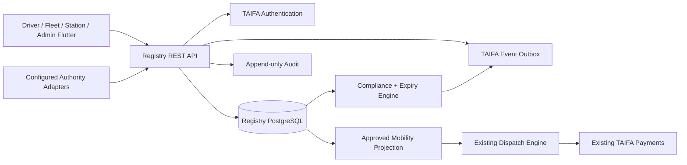
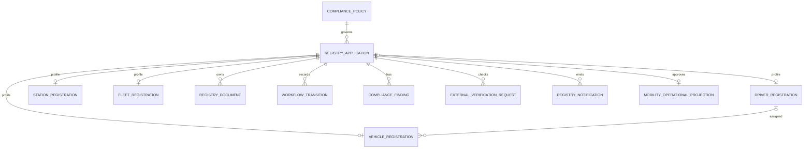
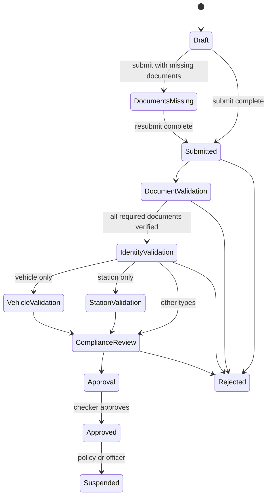

# TAIFA National Mobility Registry

## Authority and boundary

The registry is the authoritative eligibility system for drivers, vehicles,
stations, fleets and transport companies. `trips` contains operational
projections only. Approval creates a projection carrying the immutable Registry
application UUID; suspension changes the Registry first and atomically disables
the projection. Dispatch filters on both operational status and that approval
UUID.

The Registry does not implement authentication, wallets, settlement, messaging
delivery or analytics. It consumes TAIFA device authentication, enterprise
RBAC/ABAC, payment account references, the event outbox, audit records and
Prometheus.

## Data protection

- National ID, passport, phone, emergency phone, bank details, chassis number,
  engine number and document numbers use AES-GCM application encryption.
- Exact search uses HMAC-SHA256 blind indexes under a distinct key. No
  reversible PII is indexed.
- Uploaded files are AES-GCM encrypted before persistence, with authenticated
  context binding the application, document kind and version.
- Every encrypted object records its key version. Old key versions stay in the
  keyring until all associated data is re-encrypted.
- API representations expose masked values only. Downloads require ownership
  or `mobility_registry.document.read` and create an audit record.
- Files are limited to PDF/JPEG/PNG/WebP and 10 MiB. Responses use `no-store`
  and `nosniff`.
- Production startup fails if encryption or blind-index keys are absent.

## Entity relationship model

`RegistryApplication` is the lifecycle aggregate and idempotency boundary.
Profiles contain entity-specific facts. `RegistryDocument` is versioned and
allows only one current document per kind. Workflow transitions are append-only.
Compliance policies are versioned and effective-dated.

## Verification and approval flow

The applicant cannot review or approve their own application. Final approval is
blocked by missing, rejected, unverified or expired required documents and by
active blacklist matches.

## Dispatch invariant

A driver can become available or receive an offer only when:

1. Driver status, identity and driving licence are valid and
   `driver.registry_approval_id` is set.
2. An active vehicle has valid insurance, road licence and inspection and a
   Registry approval UUID.
3. The assigned station is active, verified and has a Registry approval UUID.
4. If a fleet exists, it is verified and has a Registry approval UUID.

These predicates are checked during candidate ranking and rechecked while
accepting an offer under a database transaction. Registry expiry suspension
immediately removes the operational projection from eligibility.

## Government integration

`VerificationAdapter` is the only integration contract. Provider classes are
loaded from `MOBILITY_VERIFICATION_ADAPTERS_JSON`; no NIDA, BRELA, TRA, Police,
insurance, inspection or local-government protocol is embedded in Registry
business logic. Request records contain attribute names, provider references and
sanitized results, never provider credentials.
