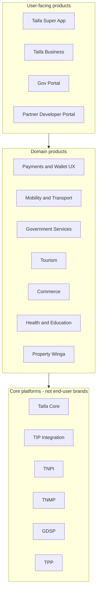
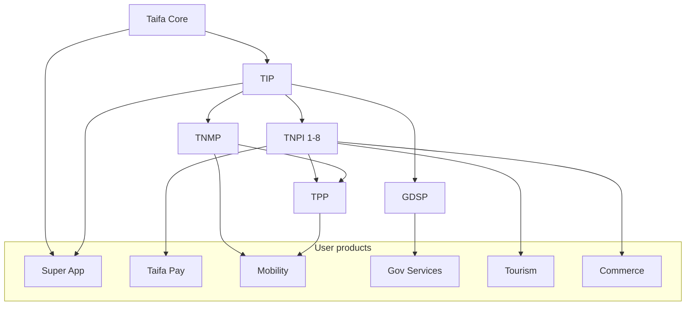
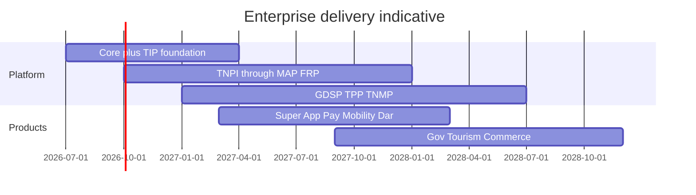

# Taifa Product Portfolio & Enterprise Delivery Roadmap

**Status:** Master execution plan — architecture → production  
**Authority:** [Architecture Constitution](architecture/00_ARCHITECTURE_CONSTITUTION.md) · [GOVERNANCE](GOVERNANCE.md)  
**Date:** 2026-08-06  
**Audience:** Executive sponsors, EARB, product, engineering, partners

---

## Executive summary

Taifa is a **national digital operating system**: a super-app experience for citizens and businesses, powered by **shared platforms** (Core, TIP, TNPI, TNMP, GDSP) and **vertical products** (mobility, government, tourism, commerce, health, education, property). This document is the **single portfolio and delivery roadmap**—what we ship to users, what platforms it runs on, MVP scope, phases, teams, partners, KPIs, and rollout.

**Golden rules**

1. **Identity** — Taifa Identity only (no duplicate login stacks).  
2. **Payments** — TNPI only (no domain payment engines).  
3. **Mobility operations** — TNMP; **transport fares/tickets** — TPP → TNPI.  
4. **Government digital services** — GDSP; fees via TNPI.  
5. **Integration** — TIP for APIs, events, webhooks, partners.  
6. **Business logic** stays in domain products; platforms provide capability, not vertical workflows.

---

## Portfolio layers

| Layer | What users see | What engineering owns |
| --- | --- | --- |
| **Experience** | Taifa app, business portal, gov portal, developer portal | Super-app shell, navigation, module registry |
| **Domain product** | Pay, ride, permit, book trip, shop, etc. | Vertical squads |
| **Platform** | Usually invisible (APIs, SSO, receipts) | Platform squads |

---

## Platform foundation (build first / parallel)

These are **not** standalone citizen products; they enable everything else.

| Platform | Purpose | Doc hub | MVP platform scope |
| --- | --- | --- | --- |
| **Taifa Core** | Identity, notifications, media, maps facade, audit, config, AI gateway, search facade, IaC | [platform/00_PLATFORM_OVERVIEW.md](platform/00_PLATFORM_OVERVIEW.md) | Identity OIDC, event bus stub, API edge v1, audit, dev/staging/prod |
| **TIP** | National integration backbone: gateways, bus, webhooks, ESB, marketplace | [integration/00_PLATFORM_OVERVIEW.md](integration/00_PLATFORM_OVERVIEW.md) | Enterprise GW, EventBridge catalog, webhooks, partner GW pilot |
| **TNPI** | National payments (8 phase products) | [payments/README.md](payments/README.md) | Phases 1–4 + FRP stub → full 1–8 per TNPI gates |
| **TPP** | Transport payments & ticketing (TNPI consumer) | [transport/00_PLATFORM_OVERVIEW.md](transport/00_PLATFORM_OVERVIEW.md) | Dar BRT/dala dala QR + SoftPOS |
| **TNMP** | National mobility OS (fleet, network, AI, gov mobility analytics) | [mobility/00_PLATFORM_OVERVIEW.md](mobility/00_PLATFORM_OVERVIEW.md) | Dar MVP: network, fleet, live map, TPP embed |
| **GDSP** | Government-as-a-Platform | [government/00_PLATFORM_OVERVIEW.md](government/00_PLATFORM_OVERVIEW.md) | Catalog, workflow, docs, municipal permit pilot |

---

## User-facing product catalog

Each product below lists: **primary users**, **platform dependencies**, **MVP**, **phases**, **business value**, **engineering team**, **release milestones**, **key partners**, **KPIs**, **rollout**.

---

### P-01 — Taifa Super App (Citizen)

| Dimension | Definition |
| --- | --- |
| **Users** | Citizens, residents, visitors |
| **Description** | Single mobile entry: home, menu, module launcher, unified profile |
| **Dependencies** | Core Identity, Notifications, Maps, TIP (APIs), module registry |
| **MVP** | SSO, home, 3 modules live (Pay, Mobility, Gov discover), push notifications |
| **Phases** | **E1** Shell + Identity · **E2** Module SDK + feature flags · **E3** Full vertical catalog |
| **Business value** | One national app; adoption funnel for all services |
| **Team** | **Super App** (Flutter + BFF) |
| **Milestones** | M1 internal dogfood · M2 Dar beta 5k users · M3 national store |
| **Partners** | MNOs (zero-rating optional), device OEMs |
| **KPIs** | MAU, DAU/MAU, module attach rate, crash-free sessions >99.5% |
| **Rollout** | Dar → regional cities → national; stagger module flags |

---

### P-02 — Taifa Pay (Consumer Payments UX)

| Dimension | Definition |
| --- | --- |
| **Users** | Consumers paying merchants, bills, transport |
| **Description** | Wallet aggregation UI, pay flows, receipts, history—not a float custodian |
| **Dependencies** | TNPI Orchestration, Payment Sources, FRP, Developer/TIP edge, Core Identity |
| **MVP** | Pay merchant QR, view receipt, link M-Pesa/Airtel source |
| **Phases** | **E1** QR pay · **E2** Bills (gov via GDSP) · **E3** P2P where policy allows |
| **Business value** | Cashless convenience; TNPI volume |
| **Team** | **Payments UX** + **TNPI** platform |
| **Milestones** | M1 sandbox E2E · M2 1k merchants · M3 100k tx/month |
| **Partners** | M-Pesa, Airtel, Mixx, banks, Visa/Mastercard acquirers |
| **KPIs** | TPV, success rate, time-to-pay, FRP decline rate |
| **Rollout** | Pilot merchants (MAP) → city → national |

---

### P-03 — Taifa Business (Merchant & Operator)

| Dimension | Definition |
| --- | --- |
| **Users** | SMEs, merchants, transport operators |
| **Description** | Onboarding, dashboard, settlements view, SoftPOS/QR management |
| **Documentation** | **[Taifa Merchant app](../taifa-merchant/00_INDEX.md)** (flagship) · TNPI [Merchant Platform](../payments/merchant/00_INDEX.md) (SoR) |
| **Dependencies** | TNPI Merchant, MAP, Settlement (read), Identity business profiles |
| **MVP** | Merchant signup, accept QR payment, daily sales view |
| **Phases** | **E1** Micro-merchant · **E2** Multi-outlet · **E3** Operator fleet (TNMP link) |
| **Business value** | Formalization, access to TNPI rails |
| **Team** | **Merchant** + **MAP** |
| **Milestones** | M1 KYC staging · M2 500 live merchants · M3 settlement reports |
| **Partners** | Banks for settlement accounts, LATRA for operators |
| **KPIs** | Active merchants, acceptance volume, churn |
| **Rollout** | Vertical pilots (retail, transport) |

---

### P-04 — Tap & Pay (Acceptance UX)

| Dimension | Definition |
| --- | --- |
| **Users** | Merchants, conductors, field staff |
| **Description** | NFC/tap, SoftPOS UX layer on MAP + orchestration |
| **Dependencies** | MAP, TNPI Orchestration, FRP, device attestation (Core) |
| **MVP** | Android SoftPOS tap-to-pay for pilot merchant |
| **Phases** | **E1** SoftPOS · **E2** NFC EMV transit-ready · **E3** Offline queue |
| **Business value** | Card/mobile present acceptance without separate terminals |
| **Team** | **Acceptance (MAP)** + mobile |
| **Milestones** | M1 PCI SAQ path · M2 transport conductor pilot |
| **Partners** | Acquirers, terminal OEMs |
| **KPIs** | Tap success rate, offline sync recovery |
| **Rollout** | Bundled with P-03 transport vertical |

Doc: [tap_pay/00_INDEX.md](tap_pay/00_INDEX.md)

---

### P-05 — Taifa Mobility (Passenger)

| Dimension | Definition |
| --- | --- |
| **Users** | Passengers |
| **Description** | Plan trip, live vehicles, tickets (TPP), AI assistant |
| **Dependencies** | TNMP, TPP, Core Maps/Notifications, Identity, TIP |
| **MVP** | BRT/dala dala map, buy QR ticket (TPP), track trip |
| **Phases** | **E1** Dar MVP · **E2** Multimodal · **E3** AI planner national |
| **Business value** | Unified mobility; cashless transit |
| **Team** | **Mobility** (TNMP + TPP squads) |
| **Milestones** | M1 Wave 1 TNMP/TPP · M2 50k tickets/mo · M3 3 cities |
| **Partners** | BRT authority, daladala unions, TRC (later) |
| **KPIs** | Tickets linked to journeys, validation success, plan-to-pay conversion |
| **Rollout** | [mobility/14_ROADMAP.md](mobility/14_ROADMAP.md) + [transport/13_ROADMAP.md](transport/13_ROADMAP.md) |

---

### P-06 — Taifa Transport Operator Console

| Dimension | Definition |
| --- | --- |
| **Users** | Fleet owners, conductors, inspectors |
| **Description** | Fleet, schedules, validation, revenue (TNPI read via TPP) |
| **Dependencies** | TNMP Operator, TPP, Identity staff roles, TNMP fleet |
| **MVP** | Fleet registry, conductor validate, daily revenue summary |
| **Phases** | **E1** Dala dala/BRT · **E2** Intercity · **E3** Inspection national |
| **Business value** | Operator efficiency, LATRA compliance data |
| **Team** | **Mobility Ops** |
| **Milestones** | M1 100 vehicles tracked · M2 operator settlement reconcile |
| **Partners** | LATRA, municipal transport |
| **KPIs** | Fleet utilization, inspection pass rate |
| **Rollout** | Per-operator onboarding playbooks |

---

### P-07 — Taifa Government (Citizen Gov Services)

| Dimension | Definition |
| --- | --- |
| **Users** | Citizens, businesses |
| **Description** | Discover services, apply, pay fees, track status |
| **Dependencies** | GDSP, Identity, TNPI, TIP, Notifications, AI assistant |
| **MVP** | Catalog, one municipal permit, pay fee, status tracking |
| **Phases** | **E1** LGA pilot · **E2** BRELA/TRA slice · **E3** National catalog |
| **Business value** | Digital-by-default government; revenue collection integrity |
| **Team** | **Government** (GDSP) |
| **Milestones** | M1 GS-P0 platform · M2 MVP council live · M5 5 MDAs |
| **Partners** | eGA, municipal councils, TRA, BRELA, NIDA (via Identity) |
| **KPIs** | Digital completion rate, fee collection via TNPI, SLA days |
| **Rollout** | [government/13_ROADMAP.md](government/13_ROADMAP.md) |

---

### P-08 — Taifa Government (Agency Officer)

| Dimension | Definition |
| --- | --- |
| **Users** | Government officers, inspectors |
| **Description** | Task inbox, approvals, inspections, document review |
| **Dependencies** | GDSP workflow, Identity staff MFA, Audit |
| **MVP** | Approve permit with maker-checker, audit trail |
| **Phases** | **E1** Municipal · **E2** Sector regulators · **E3** National dashboards |
| **Business value** | Faster service delivery, accountability |
| **Team** | **Government** |
| **Milestones** | M1 officer training · M2 80% tasks in SLA |
| **Partners** | MDAs, eGA |
| **KPIs** | Median processing time, backlog size |
| **Rollout** | Agency-by-agency certification |

---

### P-09 — Taifa Tourism

| Dimension | Definition |
| --- | --- |
| **Users** | Tourists, operators, parks |
| **Description** | Trips, bookings, park fees, connectivity packs |
| **Dependencies** | Core, TNPI (park/hotel pay), Maps, TNMP (shuttle), Tourism domain data |
| **MVP** | Park fee pay (TNPI), itinerary view, offline pack |
| **Phases** | **E1** TANAPA fees · **E2** Operators · **E3** National itinerary AI |
| **Business value** | Tourism revenue, foreign exchange, safety |
| **Team** | **Tourism** |
| **Milestones** | M1 TANAPA pilot · M2 booking partners |
| **Partners** | TANAPA, hotels, airlines |
| **KPIs** | Booking volume, fee TPV, NPS |
| **Rollout** | Northern circuit → coast → national |

Doc: [tourism/00_INDEX.md](tourism/00_INDEX.md)

---

### P-10 — Taifa Commerce

| Dimension | Definition |
| --- | --- |
| **Users** | Buyers, sellers, marketplaces |
| **Description** | Marketplace, orders, pay via TNPI, logistics hooks |
| **Dependencies** | TNPI, Merchant, MAP, Identity, Notifications |
| **MVP** | Seller listing, checkout, TNPI payment |
| **Phases** | **E1** C2C pilot · **E2** B2C · **E3** Cross-border (future) |
| **Business value** | Digital commerce inclusion |
| **Team** | **Commerce** |
| **Milestones** | M1 100 sellers · M2 GMV target |
| **Partners** | Logistics providers, telcos |
| **KPIs** | GMV, take rate, dispute rate |
| **Rollout** | Urban markets first |

Doc: [commerce_ops](commerce_ops/) · [express/00_INDEX.md](express/00_INDEX.md)

---

### P-11 — Taifa Health & Education Pay

| Dimension | Definition |
| --- | --- |
| **Users** | Patients, students, institutions |
| **Description** | Hospital/school fee presentation and pay—not clinical/edu SoR |
| **Dependencies** | TNPI, GDSP (future cases), Identity, hospital/SIS adapters via TIP |
| **MVP** | Hospital bill lookup + pay; school fee control number |
| **Phases** | **E1** Fees only · **E2** Appointments (GDSP) · **E3** NHIF hooks |
| **Business value** | Reduced cash at facilities; reconciliation |
| **Team** | **Health/Edu** + **TNPI** |
| **Milestones** | M1 2 hospitals · M2 regional MOH report |
| **Partners** | MOH, schools, NHIF |
| **KPIs** | Fee TPV, failed payment rate |
| **Rollout** | Public facilities pilot |

---

### P-12 — Winga (Property)

| Dimension | Definition |
| --- | --- |
| **Users** | Renters, landlords, agents |
| **Description** | Listings, leases, rent pay via TNPI |
| **Dependencies** | Core, TNPI, Identity, Maps, TIP |
| **MVP** | Listing + rent payment reference |
| **Phases** | **E1** Pay rent · **E2** KYC landlords · **E3** Municipal tie-in |
| **Business value** | Formal rental economy |
| **Team** | **Property (Winga)** |
| **Milestones** | M1 pilot field per Winga ops docs |
| **Partners** | Municipal housing, banks |
| **KPIs** | Rent TPV, active listings |
| **Rollout** | Dar pilot |

Doc: [winga_property/00_INDEX.md](winga_property/00_INDEX.md)

---

### P-13 — Taifa AI Assistant (Cross-cutting)

| Dimension | Definition |
| --- | --- |
| **Users** | All app users |
| **Description** | NL help across pay, mobility, gov, tourism—Core AI gateway |
| **Dependencies** | Core AI, GDSP/TNMP/Tourism tool APIs (read-only), Identity consent |
| **MVP** | FAQ + deep links; no autonomous payments |
| **Phases** | **E1** RAG · **E2** Form assist (GDSP) · **E3** Voice |
| **Business value** | Support deflection, inclusion (Swahili) |
| **Team** | **AI Platform** + vertical tool owners |
| **Milestones** | M1 gov+mobility tools · M2 satisfaction score |
| **KPIs** | Resolution rate, escalation rate, hallucination incidents (0 critical) |
| **Rollout** | Feature-flag per module |

---

### P-14 — Taifa Developer & Partner Hub

| Dimension | Definition |
| --- | --- |
| **Users** | Banks, fintechs, ISVs, agencies |
| **Description** | Docs, keys, sandbox, certification, marketplace |
| **Dependencies** | TIP (runtime), TNPI Developer Platform (DX), Identity partner IAM |
| **MVP** | Sandbox payments API, webhooks, one certified bank |
| **Phases** | **E1** TNPI APIs · **E2** Marketplace · **E3** Gov/mobility APIs |
| **Business value** | Ecosystem growth; controlled integration |
| **Team** | **Integration (TIP)** + **Developer Platform** |
| **Milestones** | M1 TIP-S5 · M2 3 certified partners · M3 marketplace live |
| **Partners** | Banks, MNOs, SIs |
| **KPIs** | Active API consumers, webhook success, time-to-certify |
| **Rollout** | [integration/21_ROADMAP.md](integration/21_ROADMAP.md) |

---

### P-15 — Taifa Admin & Operations

| Dimension | Definition |
| --- | --- |
| **Users** | Taifa ops, support, fraud, finance |
| **Description** | Internal consoles: fraud cases, recon exceptions, integration health |
| **Dependencies** | FRP, Reconciliation, TIP observability, Core Audit |
| **MVP** | Fraud case queue, integration dashboard |
| **Phases** | **E1** Fraud/recon · **E2** Gov ops · **E3** Unified SOC view |
| **Business value** | Operate national platform safely |
| **Team** | **Platform Ops** + domain ops |
| **Milestones** | M1 24/5 staffing · M2 runbooks exercised |
| **KPIs** | MTTR, exception backlog, incident count |
| **Rollout** | Internal only |

---

## TNPI platform products (engine room)

Delivered as **platform capabilities** powering P-02–P-04, P-07, P-09–P-11—not separate consumer brands.

| TNPI phase | Product | Consumer of | Milestone (indicative) |
| --- | --- | --- | --- |
| 1 | Merchant Platform | P-03 | Merchant KYC live |
| 2 | Payment Sources | P-02 | Tokenized MNO |
| 3 | Orchestration | All pay | Sandbox E2E |
| 4 | MAP (QR/SoftPOS) | P-02, P-04, P-05 | QR + SoftPOS pilot |
| 5 | Settlement | P-03, operators | Operator payouts |
| 6 | Reconciliation | P-15, finance | Daily match |
| 7 | Fraud & Risk | All pay | Pre-auth live |
| 8 | Developer Platform | P-14 | Public API edge |

Dependency: each phase gate per `docs/payments/*/PHASE*_GATE_PACKAGE.md`.

---

## Master dependency graph

---

## Enterprise delivery phases (2026–2029)

| Phase | Name | Calendar (indicative) | Platform focus | Product focus |
| --- | --- | --- | --- | --- |
| **D0** | Foundation | 2026 Q3–Q4 | Core Sprint 0–2, TIP-1, TNPI 1–3 staging | Super App shell, internal dogfood |
| **D1** | Acceptance MVP | 2027 Q1–Q2 | TNPI 4–7, TIP-2–3, TPP Wave 1, TNMP Wave 1 | P-02, P-03, P-04, P-05 Dar |
| **D2** | Government & money ops | 2027 Q3–Q4 | GDSP P0–P1, TNPI 5–6, Recon | P-07, P-08, settlement views |
| **D3** | National expansion | 2028 | TIP-4, TNMP/TPP national waves, GDSP scale | P-09–P-12 city expansion |
| **D4** | Ecosystem & smart | 2029+ | TIP-5, mesh, smart city mobility, AI maturity | P-14 marketplace, P-13 voice |

---

## Engineering team topology (recommended)

| Squad | Owns | Size (indicative) |
| --- | --- | --- |
| **Platform Core** | Identity, notifications, media, audit, IaC | 8–12 |
| **Integration (TIP)** | Gateways, bus, webhooks, ESB | 6–10 |
| **TNPI** | Payments phases (sub-teams per phase) | 20–35 |
| **Mobility** | TNMP + TPP | 12–18 |
| **Government** | GDSP + agency adapters | 10–15 |
| **Super App** | Flutter shell, module registry | 6–10 |
| **Verticals** | Tourism, Commerce, Winga, Health/Edu | 4–8 each |
| **AI** | Assistant, RAG, tool contracts | 4–6 |
| **SRE / Security** | Cross-cutting | 6–8 |
| **Program / PMO** | Roadmap, gates, KPIs | 3–5 |

---

## Release milestones (national)

| ID | Milestone | Target | Exit criteria (summary) |
| --- | --- | --- | --- |
| **R0** | Platform staging complete | 2026 Q4 | Core + TIP-1 + TNPI sandbox E2E |
| **R1** | Dar payments go-live | 2027 Q2 | 1k merchants, FRP on, MAP QR |
| **R2** | Dar mobility go-live | 2027 Q2 | TNMP/TPP MVP acceptance |
| **R3** | Gov digital pilot | 2027 Q4 | GDSP MVP + TNPI gov fees |
| **R4** | National TNPI hardening | 2028 Q2 | Settlement + recon prod |
| **R5** | Partner ecosystem | 2028 Q4 | TIP partner GW + 3 banks |
| **R6** | Multi-city mobility + tourism | 2029 | 3 cities + TANAPA pay |

---

## Partner integration matrix

| Partner class | Platforms | Products | Integration via |
| --- | --- | --- | --- |
| MNOs (M-Pesa, etc.) | TNPI Sources | P-02 | TIP adapter + PSP contract |
| Banks | TNPI, TIP | P-02, P-14 | mTLS partner GW |
| eGA / MDAs | GDSP, TIP | P-07, P-08 | Agency adapter |
| LATRA / BRT | TNMP, TPP | P-05, P-06 | TNMP API + TPP pay |
| TANAPA / tourism | TNPI, Tourism | P-09 | Fee products |
| Acquirers / EMV | MAP | P-04 | MAP certification |
| Developers | TIP, Dev Platform | P-14 | OAuth, keys, sandbox |

---

## KPI framework (portfolio level)

| Theme | KPI | Owner |
| --- | --- | --- |
| **Adoption** | MAU (super app), registered merchants | Product |
| **Payments** | TPV, success rate, TNPI revenue | TNPI |
| **Trust** | Fraud loss bps, recon match % | Risk + Finance |
| **Mobility** | Digital ticket %, vehicles tracked | Mobility |
| **Government** | % services digital end-to-end | GDSP |
| **Integration** | Partner API uptime, cert count | TIP |
| **Reliability** | Platform availability 99.9% | SRE |
| **Speed** | Lead time to production (per gate) | PMO |

---

## Rollout strategy

1. **Platform-first:** No vertical production pay without TNPI + Identity + TIP edge.  
2. **City slices:** Dar es Salaam as default pilot (pay + mobility + LGA).  
3. **Gated waves:** Each product follows architecture gate packages before national PR.  
4. **Strangler:** Legacy Django pay spine retires behind feature flags per [payments/00_PAYMENT_PROGRAM.md](payments/00_PAYMENT_PROGRAM.md).  
5. **Partner cadence:** Certify 1 bank + 1 MNO before marketing consumer pay.  
6. **Operate:** P-15 live before R1; fraud + recon staffing mandatory for R4.

---

## Governance & traceability

| Artifact | Location |
| --- | --- |
| Architecture law | [architecture/00_ARCHITECTURE_CONSTITUTION.md](architecture/00_ARCHITECTURE_CONSTITUTION.md) |
| Platform gates | [platform_governance/00_INDEX.md](platform_governance/00_INDEX.md) |
| TNPI gates | `docs/payments/*/PHASE*_GATE_PACKAGE.md` |
| TNMP / GDSP / TIP gates | `TNMP_GATE_PACKAGE`, `GDSP_GATE_PACKAGE`, `TIP_GATE_PACKAGE` |
| Decision log | [platform/17_PLATFORM_DECISION_LOG.md](platform/17_PLATFORM_DECISION_LOG.md) |
| Sprint 0 | [platform/SPRINT_0_ENGINEERING_PLAN.md](platform/SPRINT_0_ENGINEERING_PLAN.md) |

**This document** supersedes ad-hoc product lists for **execution planning**; domain architecture packs remain authoritative for technical design.

---

## Document maintenance

| Role | Action |
| --- | --- |
| **PMO** | Quarterly roadmap refresh |
| **EARB** | Approve phase transitions D0→D4 |
| **Product leads** | Update MVP/KPI per release |

**Version:** 1.0 · **Next review:** 2026-11-01
