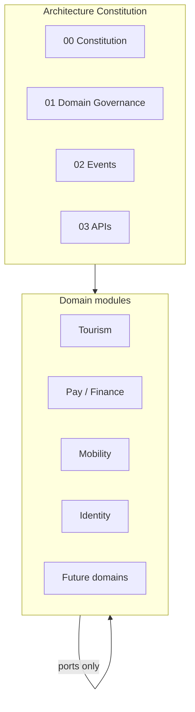
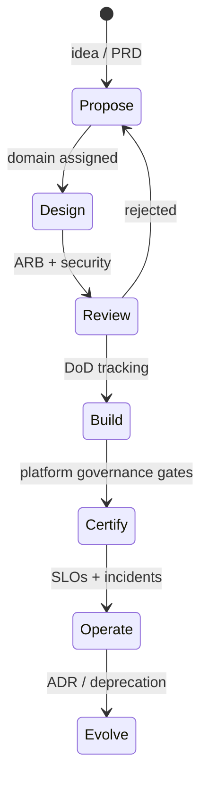

# 00 — Taifa Architecture Constitution

**Purpose:** Establish the non-negotiable architectural law for the Taifa national digital platform.  
**Scope:** All modules—Tourism, Taifa Pay, Trade, Commerce, Health, Education, Government Services, AI, Mobility, Identity, and every future domain.  
**Principles:** One platform, many bounded contexts; integrate by contract, not by shared database.

---

## Mission

Deliver **inclusive, secure, and scalable** digital public infrastructure for Tanzania and East Africa so citizens, visitors, businesses, and government interact through **one Taifa ecosystem**—without siloed data, duplicated capabilities, or fragile point integrations.

## Vision

Taifa becomes the **trusted operating system** for national digital life: identity once, pay once, move safely, learn, trade, heal, and explore—with **AI-assisted** experiences governed by human accountability and regulatory compliance.

---

## Architecture philosophy

| Belief | Implication |
| --- | --- |
| **Platform over products** | Shared Identity, Pay, Notifications, and Audit are mandatory adapters—not reimplemented per module. |
| **Domains own truth** | Each capability has exactly one system of record; others reference via ID and events. |
| **Contracts over coupling** | APIs and events are versioned public interfaces; internal refactors must not break consumers without migration. |
| **Evolution over big bang** | Modular monolith first; microservices **by extraction** when metrics justify cost. |
| **Evidence over opinion** | ADRs, OpenAPI, event schemas, and DoD checklists are proof of compliance. |



---

## Design principles

1. **Single responsibility per bounded context** — one owner per business capability.  
2. **Ubiquitous language** — terms in code match domain docs.  
3. **Fail closed** — auth, validation, and permission errors deny by default.  
4. **Idempotent side effects** — money, bookings, permits, and messages are safe to retry.  
5. **Explicit boundaries** — no “reach into” another module’s ORM/models.  
6. **Observable by default** — correlation IDs, structured logs, metrics, traces on every request.  
7. **Document before diverge** — ADR required for boundary exceptions.  
8. **Security and privacy by design** — not a release-phase checkbox.

---

## Enterprise principles

| Principle | Taifa application |
| --- | --- |
| Interoperability | OpenAPI + event schemas in registry; national API gateway patterns ([`NATIONAL_API.md`](../NATIONAL_API.md)) |
| Sovereignty | Primary data residency in approved regions; KMS customer-managed keys for regulated data |
| Inclusion | Offline-tolerant mobile, Kiswahili-first UX, low-bandwidth APIs |
| Accountability | Immutable audit for money, identity, health, and government actions |
| Anti-monopoly duplication | ARB rejects second “wallet” or “login” inside a vertical module |

---

## Domain-Driven Design (DDD)

- **Strategic:** Core, supporting, generic subdomains per module; context map maintained per domain pack.  
- **Tactical:** Aggregates enforce invariants; domain events signal state changes across contexts.  
- **Rule:** If two teams argue ownership, escalate to [01_DOMAIN_GOVERNANCE.md](01_DOMAIN_GOVERNANCE.md)—not merge tables.

---

## Clean architecture

Layers (inside each deployable module):

```
domain → application → ports → adapters (in/out)
```

- **Domain** has no framework imports (no Django/Flutter in core rules).  
- **Application** orchestrates use cases.  
- **Adapters** translate HTTP, events, DB, and SDKs.

---

## Hexagonal architecture (ports & adapters)

- **Inbound ports:** commands, queries, webhooks.  
- **Outbound ports:** `BookingPort`, `FinancePort`, `IdentityPort`, etc.  
- **Anti-corruption layer** at every legacy or partner boundary ([01_DOMAIN_GOVERNANCE.md](01_DOMAIN_GOVERNANCE.md)).

---

## Event-driven architecture

- Cross-domain integration **prefers events** after the owning aggregate commits (outbox).  
- Sync APIs for queries, strong consistency steps in sagas, and human-facing reads.  
- Catalog: [02_EVENT_CATALOG.md](02_EVENT_CATALOG.md).

---

## API-first

- No mobile-specific business rules that bypass public APIs.  
- OpenAPI is contract; breaking changes require version bump and deprecation policy ([03_API_STANDARDS.md](03_API_STANDARDS.md)).

---

## Cloud-native

- Stateless horizontal scale, health checks, graceful shutdown, 12-factor configuration, secrets externalized.  
- Primary cloud: **AWS** (Well-Architected).

---

## Security by design

- Threat modeling for new domains and payment/identity touchpoints.  
- Standards: [05_SECURITY_STANDARDS.md](05_SECURITY_STANDARDS.md).

---

## Zero trust

- Never trust network location; verify identity, device, and intent per request.  
- Service-to-service: mTLS or signed tokens with least privilege IAM.

---

## Modular monolith first

- `apps/backend` organizes by **Django apps = bounded contexts** (or facades) with strict import linting.  
- Shared kernel only for true generics (IDs, money VOs, event envelope)—not business rules.

---

## Microservices by extraction

Extract when **two or more** triggers fire (document in ADR):

| Trigger | Example signal |
| --- | --- |
| Independent scale | Checkout TPS >> rest of monolith |
| Team autonomy | Separate on-call and release cadence |
| Failure isolation | Partner adapter failures must not take down Identity |
| Compliance boundary | PCI scope reduction |
| Data volume | Shard boundary clear (e.g. ledger) |

---

## AWS Well-Architected Framework

| Pillar | Taifa expectation |
| --- | --- |
| Operational excellence | Runbooks, IaC, game days |
| Security | KMS, WAF, GuardDuty, least IAM |
| Reliability | Multi-AZ, backups, defined RPO/RTO |
| Performance efficiency | Right-sizing, caching, CDN |
| Cost optimization | Tags, autoscaling, lifecycle policies |
| Sustainability | Graviton where fit, efficient regions |

Detail: [07_DEPLOYMENT_STANDARDS.md](07_DEPLOYMENT_STANDARDS.md) and domain AWS docs (e.g. Tourism `15_AWS_DEPLOYMENT.md`).

---

## Scalability principles

- Scale **read** and **write** paths independently (CQRS where justified).  
- Partition by natural keys (`owner_id`, `tenant_id`, `market_code`).  
- Backpressure on queues; never unbounded in-memory fanout to partners.

---

## Reliability principles

- Defined SLOs per critical API (Identity, Pay, Orchestration checkout).  
- Timeouts, retries with jitter, circuit breakers on outbound ports.  
- Sagas with documented compensation ([02_EVENT_CATALOG.md](02_EVENT_CATALOG.md)).

---

## Observability principles

- **Golden signals:** latency, traffic, errors, saturation.  
- **Correlation:** `X-Correlation-Id` from edge through events.  
- Dashboards and alerts owned by the domain team—not optional after launch.

---

## Documentation standards

| Artifact | Owner | Location |
| --- | --- | --- |
| Architecture constitution | ARB | `docs/architecture/` |
| Domain pack index | Domain architect | `docs/{module}/00_INDEX.md` |
| ADR | Decision author | `docs/architecture/adr/` or `docs/{module}/adr/` |
| OpenAPI | Service owner | repo + CI artifact |

Markdown in repo is source of truth; Confluence/wiki mirrors must link back.

---

## Decision-making principles

| Decision type | Forum | Output |
| --- | --- | --- |
| New bounded context / SoR change | ARB | ADR + update `01_DOMAIN_GOVERNANCE` |
| Public API break | API Review Board | Version plan + OpenAPI |
| Security exception | Security Review | Risk acceptance + expiry |
| Production money/identity change | Change Advisory | Ticket + rollback plan |

---

## Non-functional requirements (platform defaults)

| NFR | Default target |
| --- | --- |
| Public API availability (tier-1) | 99.95% monthly |
| API p99 latency (read) | &lt; 500 ms excluding partner |
| RPO / RTO (tier-1 data) | 5 min / 1 h |
| Audit retention (financial) | ≥ 7 years metadata |
| Accessibility | WCAG 2.1 AA for citizen-facing |
| Localization | Kiswahili + English minimum |

Domain packs may tighten; never loosen without ADR.

---

## Architecture lifecycle



Aligns with [`platform_governance/01_LIFECYCLE_FRAMEWORK.md`](../platform_governance/01_LIFECYCLE_FRAMEWORK.md) Stages 0–9.

---

## Cross-references

- [01_DOMAIN_GOVERNANCE.md](01_DOMAIN_GOVERNANCE.md)  
- [09_DEFINITION_OF_DONE.md](09_DEFINITION_OF_DONE.md)  
- [08_ADR_GUIDELINES.md](08_ADR_GUIDELINES.md)  
- [`../GOVERNANCE.md`](../GOVERNANCE.md) — program boards  
- [`../tourism/CANONICAL_ENTERPRISE_ARCHITECTURE.md`](../tourism/CANONICAL_ENTERPRISE_ARCHITECTURE.md) — Tourism domain charter (subordinate to this constitution)

---

## Future considerations

- Federated identity with EAC partners  
- Multi-region active-active for Pay ledger (high complexity—ADR mandatory)  
- Event schema registry as CI gate across all repos  
- Automated architecture compliance linter (import rules, OpenAPI diff, event naming)

**Supremacy:** On conflict between a module doc and `docs/architecture/*`, the **architecture constitution** wins. Enterprise integration view: [`docs/platform/`](../platform/README.md). Tourism domain charter: [`tourism/CANONICAL_ENTERPRISE_ARCHITECTURE.md`](../tourism/CANONICAL_ENTERPRISE_ARCHITECTURE.md).
