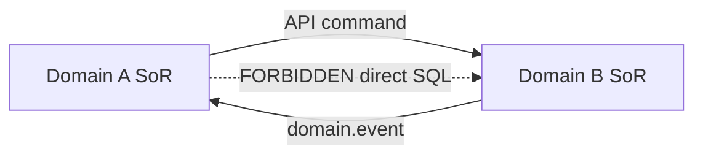
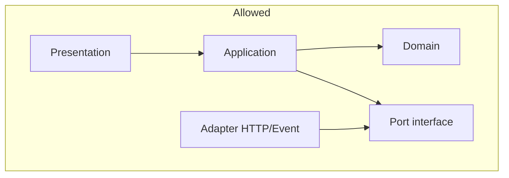

# 01 — Domain Governance

**Purpose:** Define how business capabilities are owned, bounded, and integrated across Taifa.  
**Scope:** All current and future domains (vertical modules and horizontal platforms).  
**Principles:** Exactly one system of record per capability; integrate only via APIs and domain events.

---

## Ownership rules

Every business capability has **exactly one owning domain**. Other domains may **consume** via ports; they must not **persist** another domain’s truth.

| Capability | Owner domain | Examples / modules |
| --- | --- | --- |
| Authentication & citizen identity | **Identity** | Login, sessions, KYC hooks, device trust |
| Authorization & roles | **Identity** (+ policy engine) | RBAC/ABAC definitions |
| Money & ledger | **Finance** / **Taifa Pay** | Capture, refund, wallet, splits, FX execution |
| Reservations & catalog commerce | **Commerce / Booking** | Tour, stay, retail orders (module-specific facades) |
| Travel coordination | **Travel Orchestration** (Tourism) | Trip, cart, checkout session—not inventory |
| Transport & AVL | **Mobility** | Rides, BRT, trips, SafetyIncident SoR |
| Insurance & emergency assistance | **Protection** | Policies, SOS workflow, claims |
| Connectivity (eSIM, MNO) | **Connectivity** | Orders, provisioning |
| Permits & visa refs | **Government** | Authority adapters, application state |
| AI inference & tools | **AI Experience** | Models, sessions—not committed business state |
| Recommendations (generation) | **AI Experience** | Ranking/inference |
| Destination content & reviews | **Discovery** (Tourism) | Places, UGC |
| Notifications delivery | **Notifications** (shared) | Push/SMS/email pipes |
| Fraud scoring | **Fraud** (shared) | Risk signals |
| Audit evidence | **Audit** (shared) | Immutable log store |

**Tourism illustration:** See [`../tourism/CANONICAL_ENTERPRISE_ARCHITECTURE.md`](../tourism/CANONICAL_ENTERPRISE_ARCHITECTURE.md) §2–§3.

---

## Non-negotiable integration rules

1. **No cross-domain database writes** — Domain A never `INSERT`/`UPDATE`/`DELETE` on Domain B’s tables.  
2. **Foreign keys are references, not ownership** — Store `booking_id`, `payment_id`, `policy_id` as UUIDs + type; resolve via owner API.  
3. **Sagas for multi-step consistency** — Orchestration coordinates; each step calls owner API.  
4. **Events for propagation** — State changes published after commit (outbox).  
5. **Read via API or read model** — No cross-app ORM joins in request path (warehouse OK for analytics).



---

## Bounded context rules

| Rule | Detail |
| --- | --- |
| Name | `{module}.{context}` e.g. `tourism.orchestration`, `finance.ledger` |
| Ubiquitous language | Glossary in domain pack `0N_*_DOMAIN.md` |
| Aggregate size | Small enough for single transaction; large graphs use IDs + eventual consistency |
| Context map | Maintained in module `00_INDEX.md` or canonical enterprise doc |
| Shared kernel | Only `taifa_kernel` types: Money, EventEnvelope, TenantId—no booking rules |

---

## Dependency rules

Allowed dependency direction:

```
presentation → application → domain
adapters → ports ← application
domain → (nothing outward)
```

**Cross-domain:**

| From | To | Allowed |
| --- | --- | --- |
| Any domain | **Identity** (validate token) | Yes, via SDK/port |
| Any domain | **Finance** (pay) | Yes, via Pay port |
| Orchestration | Booking, Protection, … | Yes, outbound ports only |
| Booking | Orchestration | Prefer **events**; sync callback APIs sparingly |
| Domain A | Domain B ORM/models | **Never** |



---

## Anti-corruption layer (ACL)

Use ACL when integrating:

- Legacy monolith tables being strangled  
- Partner GDS, MNO, insurer, government APIs  
- Different ubiquitous language (e.g. “reservation” vs “booking”)

| ACL responsibility | Example |
| --- | --- |
| Translate DTO ↔ domain model | Partner JSON → `BookingRef` |
| Isolate failure | Circuit breaker, fallback read |
| Version shim | v1 partner webhook → internal v2 event |

ACL lives in **adapters/out/**; never leak partner types into `domain/`.

---

## Module registration (monorepo)

- Backend: Django app per bounded context (or facade app delegating to owner).  
- Mobile: `lib/features/{module}/` with feature flags per [`super_app`](../super_app/00_INDEX.md).  
- New module requires: `docs/{module}/00_INDEX.md`, ARB review, entry in this doc’s ownership table (via ADR).

---

## Examples

**Good:** Tourism checkout calls `FinancePort.capture(idempotency_key, amount)`; stores `payment_id` on checkout aggregate.

**Bad:** Tourism `views.py` sets `commerce_tour_booking.paid = True` directly.

**Good:** Protection SOS creates Mobility incident via `MobilityPort.create_incident()`; owns `AssistanceCase`.

**Bad:** Protection writes to `trips_safetyincident` ORM from tourism app without port.

---

## Decision table — who owns the workflow?

| User journey step | Workflow owner | SoR for durable state |
| --- | --- | --- |
| Plan a trip | Travel Orchestration | Itinerary versions |
| Hold a hotel room | Booking | Reservation row |
| Pay once | Finance | Ledger entry |
| Issue insurance | Protection | Policy |
| Dispatch driver | Mobility | Leg / dispatch |
| Show inspire feed | Discovery | Content index |

---

## Cross-references

- [00_ARCHITECTURE_CONSTITUTION.md](00_ARCHITECTURE_CONSTITUTION.md)  
- [02_EVENT_CATALOG.md](02_EVENT_CATALOG.md)  
- [04_DATABASE_STANDARDS.md](04_DATABASE_STANDARDS.md)  
- [08_ADR_GUIDELINES.md](08_ADR_GUIDELINES.md)

---

## Future considerations

- Platform-wide domain registry service (machine-readable ownership for CI)  
- EAC cross-border contexts (market-specific Government adapters, shared Identity federation)  
- Health & Education HIPAA/child-data partitions as separate deployables with stricter dependency rules
