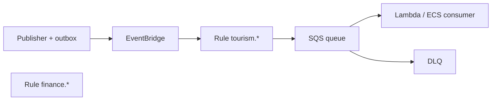

# 02 — Event Catalog (Canonical)

**Purpose:** Single naming, envelope, and operational contract for domain events across Taifa.  
**Scope:** All publishers on Amazon EventBridge (and in-process outbox during monolith phase).  
**Principles:** Past tense, owned by publisher domain, versioned schemas, idempotent consumers.

---

## Naming convention

**Canonical format:**

```
{context_prefix}.{entity}.{action}
```

| Segment | Rules | Examples |
| --- | --- | --- |
| `context_prefix` | Module or bounded context; lowercase | `tourism`, `finance`, `identity`, `mobility`, `commerce`, `protection`, `connectivity`, `government`, `ai`, `notification` |
| `entity` | Noun, singular snake case | `trip`, `booking`, `payment`, `policy` |
| `action` | Past tense verb snake case | `created`, `captured`, `issued` |

**Naming law:** [ADR 0002](adr/0002-event-catalog-prefix-policy.md) — `booking.reservation.*` for reservations; `commerce.*` for retail orders; deprecated aliases listed there.

---

| Shorthand (docs only) | Canonical event name |
| --- | --- |
| `trip.created` | `tourism.trip.created` |
| `trip.updated` | `tourism.trip.updated` (use when generic update; prefer specific e.g. `tourism.timeline.updated`) |
| `trip.completed` | `tourism.trip.completed` |
| `booking.created` | `commerce.booking.created` or `booking.reservation.created`¹ |
| `booking.confirmed` | `booking.reservation.confirmed` |
| `booking.cancelled` | `booking.reservation.cancelled` |
| `payment.authorized` | `finance.payment.authorized` |
| `payment.captured` | `finance.payment.captured` |
| `payment.refunded` | `finance.refund.completed` |
| `insurance.issued` | `protection.policy.issued` |
| `insurance.claimed` | `protection.claim.submitted` |
| `chauffeur.assigned` | `mobility.chauffeur.assigned` |
| `driver.arrived` | `mobility.driver.arrived` |
| `esim.purchased` | `connectivity.esim.ordered` |
| `esim.activated` | `connectivity.esim.provisioned` |
| `visa.approved` | `government.visa.approved` |
| `hotel.checked_in` | `booking.stay.checked_in` |
| `hotel.checked_out` | `booking.stay.checked_out` |
| `review.created` | `discovery.review.submitted` |
| `notification.sent` | `notification.message.delivered` |

¹ Tourism pack uses `booking.reservation.*` prefix without `commerce.`—**new platform events** should prefer `{module}.{entity}.{action}`; deprecate duplicates via ADR.

**Deprecated (do not use in new code):** `booking.confirmed`, `booking.paid`, `assistance.sos.opened` → see Tourism canonical §5.

---

## Envelope (mandatory)

```json
{
  "event_id": "uuid",
  "event_type": "tourism.trip.created",
  "schema_version": "1.0",
  "occurred_at": "2026-08-05T10:00:00Z",
  "correlation_id": "uuid",
  "causation_id": "uuid|null",
  "producer": "tourism-orchestration",
  "tenant_id": "uuid|null",
  "market_code": "TZ",
  "payload": { }
}
```

| Field | Purpose |
| --- | --- |
| `event_id` | Unique; consumer dedup key |
| `correlation_id` | Saga / request trace (matches `X-Correlation-Id`) |
| `causation_id` | Parent `event_id` |
| `schema_version` | Semver per `event_type` |

---

## Per-event specification template

Every registered event documents:

| Attribute | Description |
| --- | --- |
| **Producer** | Owning domain service |
| **Consumers** | Downstream domains (idempotent) |
| **Payload** | JSON schema (required fields) |
| **Schema** | EventBridge schema / Glue registry name |
| **Versioning** | Additive minor; breaking → new `event_type` or major version |
| **Idempotency** | Consumer stores `event_id` or business idempotency key |
| **Retry policy** | Exponential backoff, max attempts |
| **DLQ** | SQS DLQ per rule; alarm on depth |
| **Ordering** | Per-aggregate partition key if order required |
| **Retention** | Event archive + consumer offset policy |

---

## Platform event catalog (authoritative core)

### Tourism / orchestration

| Event | Producer | Consumers | Payload (required) | Schema ver |
| --- | --- | --- | --- | --- |
| `tourism.trip.created` | Travel Orchestration | Analytics, AI | `trip_id`, `owner_id` | 1.0 |
| `tourism.trip.planned` | Travel Orchestration | Discovery, Analytics | `trip_id`, `itinerary_version_ids[]` | 1.0 |
| `tourism.itinerary.selected` | Travel Orchestration | Booking | `trip_id`, `itinerary_version_id` | 1.0 |
| `tourism.cart.built` | Travel Orchestration | Analytics | `trip_id`, `line_count` | 1.0 |
| `tourism.checkout.started` | Travel Orchestration | Finance, Fraud | `checkout_id`, `trip_id`, `total_minor`, `currency` | 1.0 |
| `tourism.checkout.completed` | Travel Orchestration | Booking, Protection, Connectivity, Notifications | `checkout_id`, `payment_id` | 1.0 |
| `tourism.trip.activated` | Travel Orchestration | Notifications, Mobility | `trip_id`, `travel_pass_id` | 1.0 |
| `tourism.trip.completed` | Travel Orchestration | Discovery, Finance, Analytics | `trip_id`, `completed_at` | 1.0 |
| `tourism.replan.proposed` | Travel Orchestration | AI, Presentation | `trip_id`, `proposal_id` | 1.0 |
| `tourism.replan.committed` | Travel Orchestration | Booking, Finance | `trip_id`, `proposal_id` | 1.0 |
| `tourism.timeline.updated` | Orchestration projector | Notifications | `trip_id`, `entries[]` | 1.0 |

### Booking / commerce

| Event | Producer | Consumers | Payload (required) | Schema ver |
| --- | --- | --- | --- | --- |
| `booking.hold.created` | Booking | Orchestration | `hold_id`, `sku_ref`, `expires_at` | 1.0 |
| `booking.reservation.confirmed` | Booking | Orchestration, Analytics | `reservation_id`, `type`, `confirmation_code` | 1.0 |
| `booking.reservation.paid` | Booking | Orchestration | `reservation_id`, `payment_id` | 1.0 |
| `booking.reservation.cancelled` | Booking | Orchestration, Finance | `reservation_id`, `reason` | 1.0 |
| `booking.stay.checked_in` | Booking | Orchestration, Analytics | `reservation_id`, `at` | 1.0 |
| `booking.stay.checked_out` | Booking | Orchestration | `reservation_id`, `at` | 1.0 |

### Finance

| Event | Producer | Consumers | Payload (required) | Schema ver |
| --- | --- | --- | --- | --- |
| `finance.payment.authorized` | Finance | Orchestration, Fraud | `payment_id`, `amount_minor`, `currency` | 1.0 |
| `finance.payment.captured` | Finance | Orchestration, Booking, Fraud | `payment_id`, `capture_id` | 1.0 |
| `finance.refund.completed` | Finance | Orchestration | `refund_id`, `payment_id`, `amount_minor` | 1.0 |
| `finance.split.executed` | Finance | Partners, Analytics | `payment_id`, `splits[]` | 1.0 |

### Protection

| Event | Producer | Consumers | Payload (required) | Schema ver |
| --- | --- | --- | --- | --- |
| `protection.policy.issued` | Protection | Orchestration, Analytics | `policy_id`, `trip_id` | 1.0 |
| `protection.sos.opened` | Protection | Orchestration, Mobility, Notifications, Ops | `case_id`, `trip_id`, `safety_incident_id` | 1.0 |
| `protection.claim.submitted` | Protection | Finance | `claim_id`, `policy_id` | 1.0 |

### Connectivity

| Event | Producer | Consumers | Payload (required) | Schema ver |
| --- | --- | --- | --- | --- |
| `connectivity.esim.quoted` | Connectivity | Orchestration | `quote_id`, `plan_id` | 1.0 |
| `connectivity.esim.ordered` | Connectivity | Orchestration | `order_id`, `trip_id` | 1.0 |
| `connectivity.esim.provisioned` | Connectivity | Orchestration, Notifications | `order_id`, `iccid` | 1.0 |

### Mobility

| Event | Producer | Consumers | Payload (required) | Schema ver |
| --- | --- | --- | --- | --- |
| `mobility.leg.scheduled` | Mobility | Orchestration | `leg_id`, `trip_id` | 1.0 |
| `mobility.chauffeur.assigned` | Mobility | Orchestration, Notifications | `leg_id`, `driver_id` | 1.0 |
| `mobility.driver.arrived` | Mobility | Orchestration, Notifications | `leg_id`, `location` | 1.0 |
| `mobility.incident.recorded` | Mobility | Protection, Ops | `incident_id`, `trip_id` | 1.0 |

### Government

| Event | Producer | Consumers | Payload (required) | Schema ver |
| --- | --- | --- | --- | --- |
| `government.visa.approved` | Government | Orchestration, Booking | `application_id`, `traveler_ref` | 1.0 |
| `government.permit.issued` | Government | Orchestration, Booking | `permit_id`, `authority` | 1.0 |

### Discovery & AI

| Event | Producer | Consumers | Payload (required) | Schema ver |
| --- | --- | --- | --- | --- |
| `discovery.review.submitted` | Discovery | Analytics | `review_id`, `place_id` | 1.0 |
| `ai.plan.generated` | AI Experience | Orchestration | `session_id`, `trip_id` | 1.0 |
| `ai.replan.suggested` | AI Experience | Orchestration | `session_id`, `proposal_ref` | 1.0 |

### Notifications

| Event | Producer | Consumers | Payload (required) | Schema ver |
| --- | --- | --- | --- | --- |
| `notification.message.delivered` | Notifications | Analytics | `message_id`, `channel` | 1.0 |

---

## Operational defaults

| Concern | Policy |
| --- | --- |
| **Idempotency** | Consumers dedupe on `event_id`; producers never reuse `event_id` |
| **Retry** | EventBridge → SQS: max 5 retries, exponential backoff 1s–300s |
| **DLQ** | Messages after max retries → DLQ; P1 alert if DLQ &gt; 0 for tier-1 events |
| **Ordering** | Use `detail-type` + partition key = aggregate id (`trip_id`, `payment_id`) when strict order needed |
| **Retention** | EventBridge archive 90 days default; tier-1 financial 7 years in S3 Glacier via export job |
| **Bus** | `taifa-platform` (shared); rules filter by prefix `tourism.`, `finance.`, etc. |



---

## Versioning

- **Additive:** new optional payload fields → bump `schema_version` minor.  
- **Breaking:** new event name or major version; dual-publish during migration window (ADR).  
- **Registry:** CI validates producer payloads against JSON Schema.

---

## Cross-references

- Tourism detail: [`../tourism/11_EVENT_ARCHITECTURE.md`](../tourism/11_EVENT_ARCHITECTURE.md) (subordinate to this catalog)  
- [01_DOMAIN_GOVERNANCE.md](01_DOMAIN_GOVERNANCE.md)  
- [09_DEFINITION_OF_DONE.md](09_DEFINITION_OF_DONE.md)

---

## Future considerations

- Central schema repo + codegen for Python/Dart  
- Event catalog API for partner subscriptions  
- Standard `market_code` and `data_classification` in envelope for cross-border
