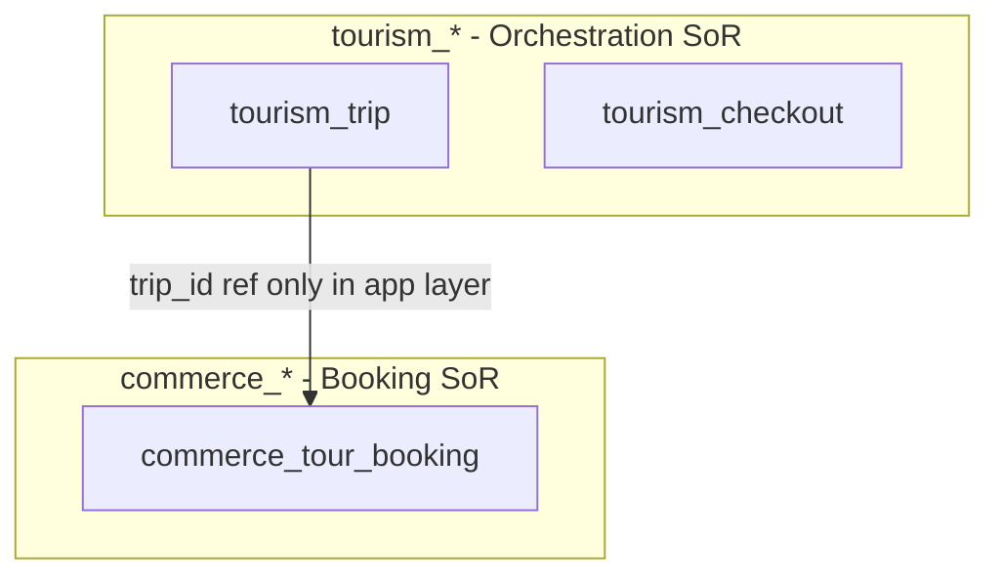

# 04 — Database Standards

**Purpose:** Govern relational and auxiliary data stores so domains retain schema sovereignty.  
**Scope:** PostgreSQL (primary), Redis, OpenSearch, DynamoDB where adopted.  
**Principles:** One writer per table; migrations reviewed; auditable history.

---

## Schema ownership

- Every table has a **single owning domain** documented in module canonical doc.  
- Table prefix hints owner: `tourism_*`, `commerce_*`, `trips_*`, `payments_*`.  
- **No shared writes** across domains ([01_DOMAIN_GOVERNANCE.md](01_DOMAIN_GOVERNANCE.md)).

---

## Migration strategy

| Rule | Detail |
| --- | --- |
| Tool | Django migrations / Flyway-style per service after extraction |
| Review | DBA + domain owner for indexes & locks |
| Expand-contract | Add column → dual write → backfill → remove old (ADR for large tables) |
| Reversible | Prefer reversible migrations; irreversible requires ADR |
| Production | No manual hotfix SQL without Change Advisory for tier-1 |

---

## Naming conventions

| Object | Convention |
| --- | --- |
| Tables | `snake_case`, plural where ORM uses model name mapping |
| Columns | `snake_case` |
| PK column | `id` (UUID) |
| FK | `{entity}_id` |
| Indexes | `idx_{table}_{columns}` |
| Constraints | `uq_{table}_{columns}`, `fk_{table}_{ref}` |

---

## Primary keys & UUID policy

- **Default:** UUID v4 (or v7 for time-order) for all public-facing aggregates.  
- **Never** expose sequential integer IDs externally for citizen PII resources.  
- Internal join tables may use bigint surrogate only if not exposed API-side.

---

## Audit columns (recommended)

| Column | Type | Notes |
| --- | --- | --- |
| `created_at` | timestamptz | UTC |
| `updated_at` | timestamptz | auto |
| `created_by` | uuid nullable | subject or service principal |
| `updated_by` | uuid nullable | |
| `version` | int | optimistic locking on hot aggregates |

---

## Soft delete

- Use `deleted_at` timestamptz where recovery/compliance needed.  
- Hard delete only for GDPR erasure workflows with audit record.  
- Queries default `WHERE deleted_at IS NULL` in repositories.

---

## Indexes

- Index every FK used in joins and filter columns in list APIs.  
- Partial indexes for status filters (`WHERE status = 'active'`).  
- Review `EXPLAIN` for p95 slow queries in staging before prod.

---

## Partitioning

- Consider partition by `created_at` or `market_code` when table &gt; 100M rows.  
- Partition key must match query patterns (ADR).

---

## Read models & CQRS

- Projections (timeline, search) may live in **separate tables** or OpenSearch.  
- Projectors consume events; **never** authoritative for money/bookings.  
- Rebuild path documented (replay from archive).

---

## Materialized views

- Allowed for analytics/reporting schemas only—not OLTP request path.  
- Refresh schedule + ownership in ops runbook.

---

## Caching

| Layer | Use |
| --- | --- |
| Redis | Session, idempotency keys, hot read models |
| TTL | Always set; cache aside pattern |
| Invalidation | On domain event or write-through for strong consistency needs |

**Rule:** Cache is not SoR.

---

## ER governance diagram

---

## Cross-references

- [01_DOMAIN_GOVERNANCE.md](01_DOMAIN_GOVERNANCE.md)  
- Tourism: [`../tourism/13_DATABASE_ARCHITECTURE.md`](../tourism/13_DATABASE_ARCHITECTURE.md)  
- [`../governance/DATA_GOVERNANCE.md`](../governance/DATA_GOVERNANCE.md)

---

## Future considerations

- Row-level security (RLS) for multi-tenant Health/Education  
- Column-level encryption for national ID fields  
- Read replica routing in ORM for reporting
