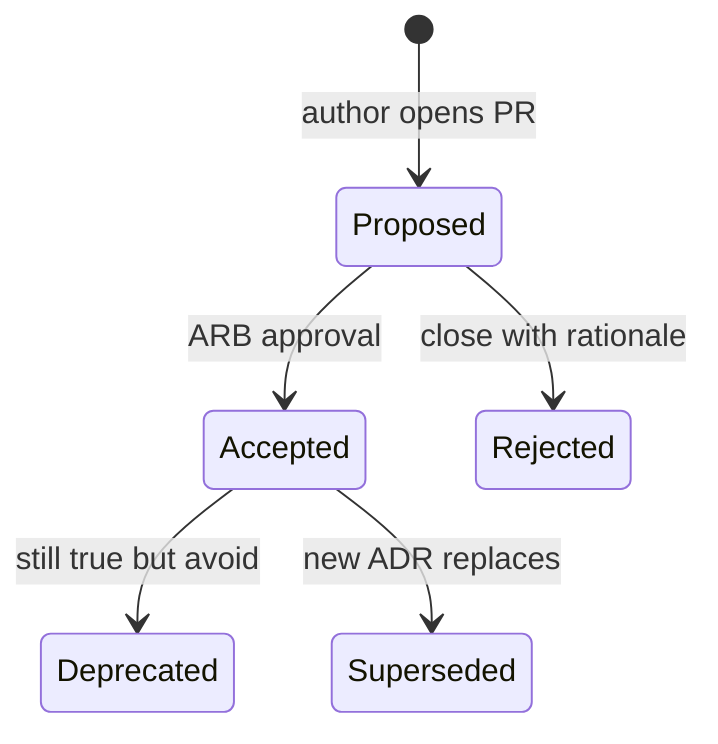

# 08 — ADR Guidelines

**Purpose:** Official process for recording architectural decisions across Taifa.  
**Scope:** All modules; platform ADRs in `docs/architecture/adr/`, module ADRs in `docs/{module}/adr/`.  
**Principles:** Decisions are discoverable, reviewable, and supersedeable.

---

## When an ADR is required

| Situation | ADR |
| --- | --- |
| New bounded context or SoR change | **Yes** |
| Cross-domain table in wrong Django app | **Yes** |
| New event type on public bus | **Yes** (or update catalog + lightweight ADR) |
| Breaking API major version | **Yes** |
| Microservice extraction | **Yes** |
| Library/framework choice affecting all teams | **Yes** |
| Routine feature in assigned domain | No (unless boundary touch) |

---

## Template

```markdown
# ADR NNN — Title

**Status:** Proposed | Accepted | Deprecated | Superseded by ADR-XXX  
**Date:** YYYY-MM-DD  
**Deciders:** ARB, {names}  
**Domains affected:** {list}

## Context

What is the issue or forcing function?

## Decision

What we will do.

## Consequences

Positive, negative, mitigations.

## Compliance

- Constitution / domain governance refs
- Events, APIs, tables impacted

## Alternatives considered

| Option | Rejected because |
```

---

## Lifecycle



---

## Status definitions

| Status | Meaning |
| --- | --- |
| **Proposed** | Under review; do not implement boundary changes yet |
| **Accepted** | Binding until superseded |
| **Deprecated** | Still in effect historically; new work should migrate |
| **Superseded** | Replaced by linked ADR |

---

## Review process

1. Author opens PR with ADR markdown + links to domain docs.  
2. **ARB** reviews within 5 business days for boundary changes.  
3. Security Review if PCI/PII/Identity impact.  
4. Merge ADR **before** or **with** implementing PR (never after silently).

---

## Approval process

| ADR type | Approver |
| --- | --- |
| Platform-wide | ARB chair + platform architect |
| Module-local packaging | Module architect + ARB delegate |
| Security exception | Security Review + risk acceptance expiry date |

---

## Superseding decisions

- New ADR must list `Supersedes: ADR-NNN` and update old ADR status to **Superseded by ADR-MMM**.  
- Index in `docs/architecture/adr/README.md` or module `adr/README.md`.

---

## Existing ADRs (reference)

| ID | Location |
| --- | --- |
| Tourism 0001 | [`../tourism/adr/0001-phase1-protection-connectivity-in-tourism-app.md`](../tourism/adr/0001-phase1-protection-connectivity-in-tourism-app.md) |
| Program | [`../adr/README.md`](../adr/README.md) |

---

## Cross-references

- [00_ARCHITECTURE_CONSTITUTION.md](00_ARCHITECTURE_CONSTITUTION.md)  
- [01_DOMAIN_GOVERNANCE.md](01_DOMAIN_GOVERNANCE.md)  
- [`../platform_governance/04_ARCHITECTURE_REVIEW_GUIDE.md`](../platform_governance/04_ARCHITECTURE_REVIEW_GUIDE.md)

---

## Future considerations

- ADR linter in CI (numbered sequence, status valid)  
- Machine-readable ADR index for compliance dashboards
