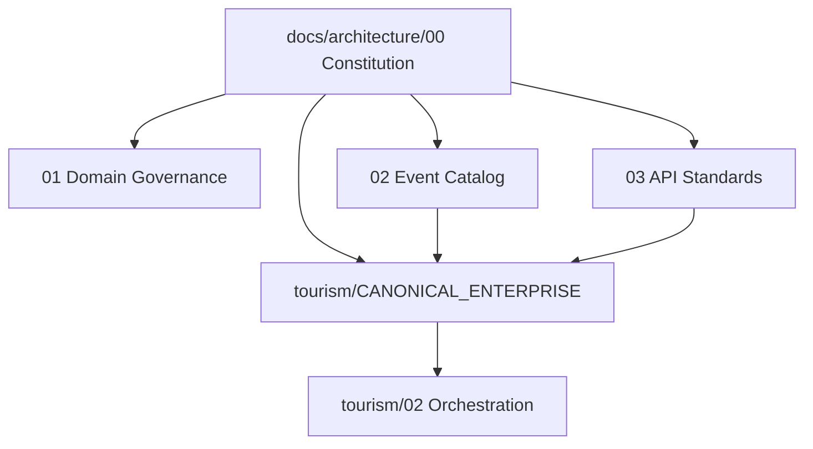

# Governance Compliance Report — Tourism vs Taifa Architecture Constitution

**Date:** 2026-08-05  
**Scope:** [`docs/tourism/`](../tourism/) domain pack reviewed against [`docs/architecture/`](../architecture/)  
**Status:** Pre-implementation governance review — **no code changes**  
**Reviewer role:** Chief Enterprise Architect (platform)

---

## Executive summary

The Tourism domain pack is **architecturally mature** and **largely compliant** with the new platform constitution. Bounded contexts, orchestration-vs-delegate rules, checkout saga, and ADR-0001 are well aligned with [01_DOMAIN_GOVERNANCE.md](01_DOMAIN_GOVERNANCE.md) and [02_EVENT_CATALOG.md](02_EVENT_CATALOG.md).

**Gaps are mostly documentation hierarchy, naming normalization, and phase-1 physical packaging**—not fundamental DDD errors. Address the **P0 recommendations** before resuming feature implementation.

| Rating | Area |
| --- | --- |
| **Green** | Nine domains, orchestration blueprint v2, canonical charter, integration rules |
| **Amber** | Dual API/event standard docs, URL namespaces, event names not fully registered |
| **Amber** | Phase-1 Django colocation (ADR-0001—accepted exception) |
| **Red** | None at architecture-doc level; **code-level boundary enforcement** not verified in this review |

---

## Compliance matrix

| Constitution doc | Tourism alignment | Notes |
| --- | --- | --- |
| [00_ARCHITECTURE_CONSTITUTION](00_ARCHITECTURE_CONSTITUTION.md) | Compliant | DDD, hexagonal, monolith-first, event-driven reflected in tourism docs |
| [01_DOMAIN_GOVERNANCE](01_DOMAIN_GOVERNANCE.md) | Compliant | CANONICAL §2–§4 match ownership table |
| [02_EVENT_CATALOG](02_EVENT_CATALOG.md) | Partial | Tourism §5 aligned; shorthand vs `tourism.*` documented; 2 events pending registry sync |
| [03_API_STANDARDS](03_API_STANDARDS.md) | Partial | `12_API_STANDARDS` extends platform; mixed `commerce` + `tourism` paths remain |
| [04_DATABASE_STANDARDS](04_DATABASE_STANDARDS.md) | Partial | Ownership table clear; phase-1 cross-app deployment per ADR-0001 |
| [05_SECURITY_STANDARDS](05_SECURITY_STANDARDS.md) | Compliant | `14_SECURITY_ARCHITECTURE` consistent with zero trust/idempotency |
| [06_CODING_STANDARDS](06_CODING_STANDARDS.md) | Partial | Target folders documented; monolith not fully layered |
| [07_DEPLOYMENT_STANDARDS](07_DEPLOYMENT_STANDARDS.md) | Compliant | `15_AWS_DEPLOYMENT` aligns with platform AWS list |
| [08_ADR_GUIDELINES](08_ADR_GUIDELINES.md) | Compliant | ADR-0001 follows process; module `adr/` exists |
| [09_DEFINITION_OF_DONE](09_DEFINITION_OF_DONE.md) | Partial | Tourism §12 gate exists; should explicitly reference platform DoD |

---

## Strengths (no change required)

1. **Clear orchestration boundary** — [02_TRAVEL_ORCHESTRATION_DOMAIN.md](../tourism/02_TRAVEL_ORCHESTRATION_DOMAIN.md) v2.0 covers lifecycle, sagas, ports, and explicit out-of-scope table.  
2. **Canonical enterprise charter** — [CANONICAL_ENTERPRISE_ARCHITECTURE.md](../tourism/CANONICAL_ENTERPRISE_ARCHITECTURE.md) resolves overlaps (split metadata vs Finance execution, SafetyIncident SoR, AI vs Protection `assist`).  
3. **ADR-0001** — Phase-1 Protection/Connectivity tables in `taifa_tourism` is a **governed exception**, not silent violation.  
4. **Event registry** — Past-tense, prefixed events; deprecated aliases documented.  
5. **Checkout saga** — Single authoritative sequence in canonical §8 and orchestration doc.

---

## Inconsistencies

| ID | Issue | Location | Resolution |
| --- | --- | --- | --- |
| I1 | **Two event authorities** — platform `02_EVENT_CATALOG` vs tourism `11_EVENT_ARCHITECTURE` | `docs/tourism/11_*` | Add banner: subordinate to platform catalog; tourism doc = envelope/outbox/saga detail only |
| I2 | **Two API authorities** — platform `03_*` vs tourism `12_*` | `docs/tourism/12_*` | Banner + link; tourism retains module-specific examples |
| I3 | **Hierarchy not explicit** — tourism canonical did not state platform constitution supremacy | `CANONICAL_ENTERPRISE_ARCHITECTURE.md` | **Fixed:** platform `docs/architecture/*` supersedes on cross-cutting standards |
| I4 | **`booking.reservation.*` vs `commerce.booking.*`** — dual prefix in platform catalog | `02_EVENT_CATALOG.md` | Tourism keeps `booking.reservation.*`; ADR-0002 (future) to unify commerce module prefix |
| I5 | **Implementation gate vs DoD** — tourism §12 vs platform §09 | Both | Cross-link; PRs must satisfy **both** for tourism changes |

---

## Duplicated responsibilities (resolved in docs; watch in code)

| Topic | Doc resolution | Compliance risk when coding |
| --- | --- | --- |
| Payment split | Orchestration metadata; Finance executes | Re-implementing splits in `tourism` |
| Recommendations | AI generates; Discovery surfaces | Duplicate rankers in mobile catalog |
| Insurance rows | Protection owns; `commerce` legacy table | New insurance logic in orchestration views |
| Emergency | Protection workflow; Mobility incident SoR | Direct ORM to `trips` from tourism without port |

**Verdict:** Documentation **merged**; implementation must use ports (see [06_CODING_STANDARDS](06_CODING_STANDARDS.md)).

---

## Boundary violations

| Item | Severity | Status |
| --- | --- | --- |
| `tourism_assistance_case` / `tourism_esim_order` in Django `tourism` app | Low (documented) | **ADR-0001 Accepted** — logical owners 06/05 |
| `POST /tourism/assist/*` under orchestration URL tree | Low | Canonical §6: migrate to `/tourism/protection/`; alias retained |
| Potential checkout → direct `commerce` ORM updates | High if present in code | **Not audited in this doc review** — mandate port + contract tests before prod |

---

## Naming issues

| Issue | Current | Target |
| --- | --- | --- |
| SOS routes | `tourism/assist/sos` | `tourism/protection/sos` |
| OpenAPI tags | Mixed “Assist” | `Tourism - Protection`, `Tourism - Connectivity`, `Tourism - Orchestration` |
| Events not in platform catalog yet | — | Register `tourism.trip.completed`, `tourism.replan.committed` in platform + tourism canonical §5 |
| Shorthand in product copy | `trip.created` | Always `tourism.trip.created` in code/EventBridge |

---

## Missing standards (tourism pack)

| Gap | Recommendation |
| --- | --- |
| Platform constitution link on tourism index | Add prominent link at top of `00_INDEX.md` |
| Database doc subordination | Banner on `13_DATABASE_ARCHITECTURE.md` → `04_DATABASE_STANDARDS` |
| Platform-level ADR index | `docs/architecture/adr/README.md` listing cross-module ADRs |
| Automated compliance | CI: OpenAPI spectral, event name lint (future) |
| Code import matrix | Enforce forbidden `commerce` imports in `tourism/domain` (future) |

---

## Recommendations (prioritized)

### P0 — Before implementation resumes

1. **Adopt platform hierarchy** — All tourism PRs cite [09_DEFINITION_OF_DONE.md](09_DEFINITION_OF_DONE.md) + tourism canonical §12.  
2. **Sync event registry** — Add `tourism.trip.completed` and `tourism.replan.committed` to [CANONICAL_ENTERPRISE_ARCHITECTURE.md](../tourism/CANONICAL_ENTERPRISE_ARCHITECTURE.md) §5 and platform [02_EVENT_CATALOG.md](02_EVENT_CATALOG.md).  
3. **Subordination banners** — Tourism `11`, `12`, `13` point to platform `02`, `03`, `04` (see index updates).  
4. **OpenAPI tag plan** — Document-only mapping in tourism `12` or orchestration `02` §15 (no code).

### P1 — Next architecture sprint

5. **ADR-0002** — Event prefix policy for Commerce (`booking.*` vs `commerce.booking.*`).  
6. **Protection/Connectivity URL migration plan** — Deprecation timeline for `assist/*`.  
7. **Outbox + EventBridge** — Align tourism `11` implementation plan with platform `02` operational defaults.

### P2 — Continuous

8. Expand compact tourism domain docs 04–08 to full template where teams onboard.  
9. Architecture compliance linter in CI.  
10. Quarterly governance re-audit per module (Pay, Mobility, Commerce next).

---

## Diagram — documentation hierarchy (target)

---

## Sign-off

| Role | Status |
| --- | --- |
| Architecture constitution pack | **Published** |
| Tourism domain pack | **Compliant with P0 actions** |
| Implementation | **Remain frozen** until P0 doc sync complete |

---

## Cross-references

- [README.md](README.md) — architecture index  
- [../tourism/00_INDEX.md](../tourism/00_INDEX.md)  
- [../GOVERNANCE.md](../GOVERNANCE.md)
