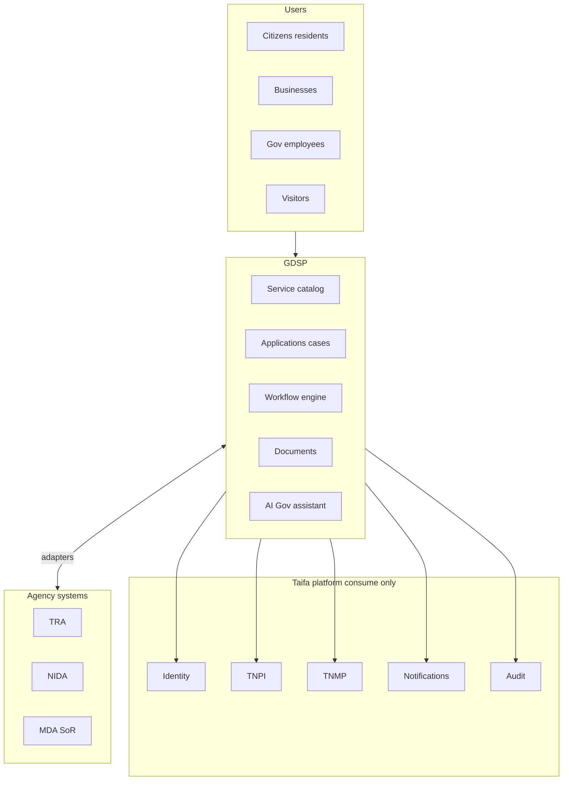
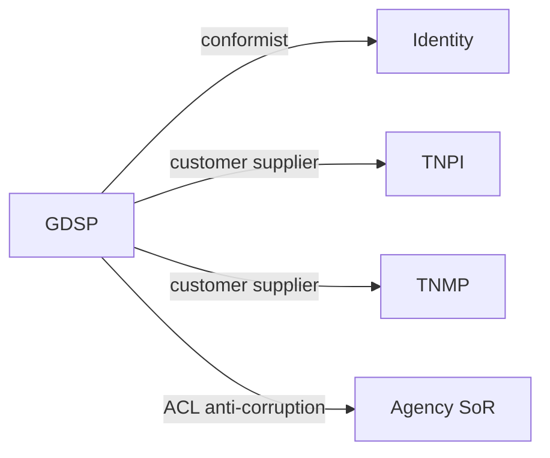

# Taifa Government Digital Services Platform (GDSP) — Overview

**Product:** Government Digital Services Platform (GDSP)  
**Program:** Government Digital Services  
**Model:** **Government-as-a-Platform (GaaP)**  
**Bounded context:** `government.platform` (+ `government.{agency}` adapters)  
**Status:** Architecture & implementation planning — **no production code**

---

## Executive summary

**GDSP** is Tanzania’s shared **Government-as-a-Platform**: one secure, interoperable digital layer for ministries, agencies, departments, and local authorities to deliver services—**without** each institution building isolated portals, identity, payments, or workflow stacks.

Citizens, businesses, and officials interact through **one national entry**; agencies plug in via APIs, events, and certified adapters.

---

## Mission

```
Citizens · Businesses · Agencies → GDSP (catalog, cases, workflows, documents) → Agency SoR
                                      ↓
                    Taifa Identity · TNPI · TNMP · Core shared services
```

---

## Core principles

Government-as-a-Platform · Digital by default · API first · Cloud native · Zero trust · Citizen-centric · Interoperability · Open standards · Shared services · Security by design · Event-driven.

---

## Business architecture



---

## Capability map (L0)

| L0 | Capabilities |
| --- | --- |
| **Identity** | Citizen, business, staff auth *(Taifa Identity)* |
| **Discovery** | Service catalog, search, AI finder |
| **Transaction** | Applications, permits, licenses, forms |
| **Process** | Workflow, approvals, inspections, appointments |
| **Evidence** | Documents, verification, certificates, signatures |
| **Engagement** | Notifications, messaging, feedback, tracking |
| **Compliance** | Audit, analytics, service levels |
| **Commerce** | Fees, taxes, fines *(TNPI only)* |

---

## Government service taxonomy

| Tier | Examples |
| --- | --- |
| **T1 Life events** | Birth, death, marriage (RITA), ID (NIDA) |
| **T2 Economic** | Business reg (BRELA), tax (TRA), licenses |
| **T3 Mobility** | LATRA, permits *(TNMP + TNPI)* |
| **T4 Environment & assets** | TANAPA, NEMC, EWURA, TMDA |
| **T5 Local** | Municipal permits, parking, rates |
| **T6 Justice & safety** | Courts, police, fire |
| **T7 Social** | Health, education fees |
| **T8 Cross-cutting** | eGA oversight, inter-agency workflow |

---

## Domain model (summary)

| Aggregate | Owner | Notes |
| --- | --- | --- |
| `ServiceDefinition` | GDSP | Catalog metadata |
| `ServiceRequest` / `Application` | GDSP | Case file |
| `WorkflowInstance` | GDSP | BPM state |
| `Document` | GDSP (+ Media) | Evidence |
| `Appointment` | GDSP | Booking |
| `Inspection` | GDSP | Field ops |
| `PaymentInstruction` | TNPI | GDSP stores `payment_id` only |
| `LegalEntity` (business) | Agency/BRELA | GDSP mirror ref |
| `Person` | NIDA via Identity | Subject ref only |

---

## Context map



---

## Document map

| # | Document |
| --- | --- |
| Gate | [GDSP_GATE_PACKAGE.md](GDSP_GATE_PACKAGE.md) |
| 01–18 | See files in this directory |

---

## Boundaries (do not duplicate)

| Capability | Use |
| --- | --- |
| Authentication / SSO / MFA | **Taifa Identity** only |
| Payments | **TNPI** only |
| Transport services | **TNMP** / TPP where applicable |
| Mobility payments | **TPP → TNPI** |

---

## Cross-references

[Architecture Constitution](../architecture/00_ARCHITECTURE_CONSTITUTION.md) · [Taifa Core](../platform/00_PLATFORM_OVERVIEW.md) · [TNPI](../payments/00_PAYMENT_PROGRAM.md) · [TNMP](../mobility/00_PLATFORM_OVERVIEW.md)
