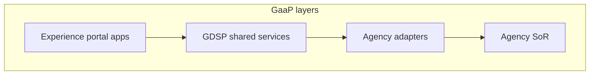
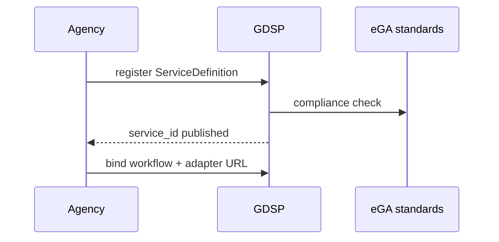

# 01 — Government Platform (GaaP)

---

## Executive summary

**Government-as-a-Platform** layer: shared runtime for catalog, applications, workflows, documents, and integrations—agencies publish **services**, not duplicate platforms.

---

## Business purpose

Reduce cost, increase interoperability, and give citizens one trusted digital state.

---

## Architecture overview

---

## Institution integration model

| Institution type | Integration pattern |
| --- | --- |
| eGA | Platform policy, service standards |
| NIDA | Identity verification API |
| TRA, BRELA, RITA, Immigration | Case sync + payment refs |
| LATRA, TANAPA, NEMC, EWURA, TMDA | Sector adapters |
| Municipal councils | Tenant org + local catalog |
| Ministries | Service ownership in catalog |
| Courts, police, fire | High-security workflows |
| Hospitals, universities, schools | Sector payment + appointments |

---

## Shared vs agency-specific

| Shared (GDSP) | Agency |
| --- | --- |
| Login, MFA | Business rules |
| Catalog shell | Legal SoR |
| Workflow engine | Decision authority |
| Document vault | Record of truth |
| TNPI checkout | Tariff tables |
| Notifications templates | Content approval |

---

## Sequence: agency onboards service

---

## Digital by default

Paper fallback documented; service level targets per eGA policy.

---

## Security

Zero trust between GDSP and agency adapters — [10_SECURITY_MODEL.md](10_SECURITY_MODEL.md).

---

## AWS

Multi-tenant SaaS on shared cluster — [11_AWS_ARCHITECTURE.md](11_AWS_ARCHITECTURE.md).

---

## Implementation strategy

MVP single agency vertical → horizontal platform — [13_ROADMAP.md](13_ROADMAP.md).

---

## Future expansion

Regional East Africa government interoperability.

---

## Cross-references

[02_SERVICE_CATALOG.md](02_SERVICE_CATALOG.md) · [17_GOVERNMENT_INTEGRATION_GUIDE.md](17_GOVERNMENT_INTEGRATION_GUIDE.md)
