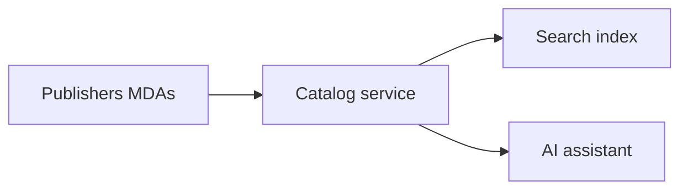
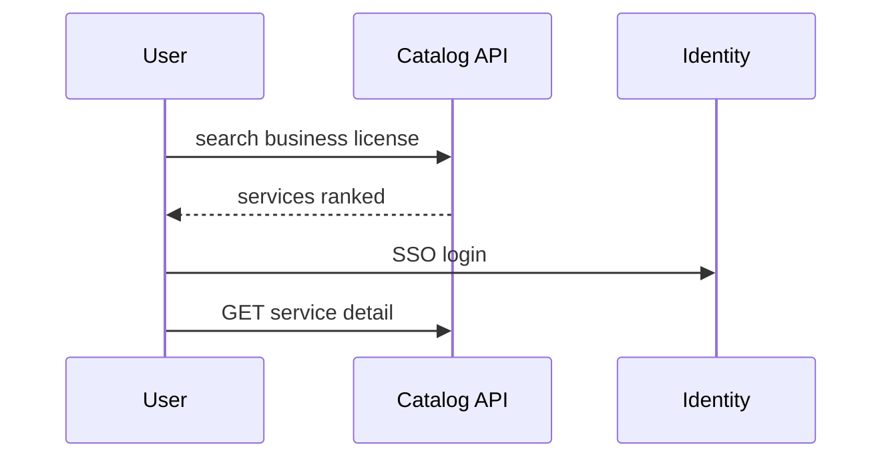

# 02 — Service Catalog

---

## Executive summary

National **service catalog**: discoverable government services with metadata, eligibility, fees, SLAs, forms, and deep links to workflows—searchable and AI-discoverable.

---

## Business purpose

One index of “what government offers” across MDAs and LGAs.

---

## Architecture overview

---

## Service taxonomy

Categories: Identity · Tax · Business · Licenses · Permits · Health · Education · Justice · Transport · Environment · Local government · Tourism · Utilities.

---

## ServiceDefinition schema (logical)

- `service_id`, `owner_org_id`, `version`  
- `title_sw`, `title_en`, `description`  
- `audience`: citizen | business | visitor | staff  
- `channel`: web | mobile | agent  
- `fee_policy_ref` → TNPI product code  
- `workflow_id`, `form_ids[]`  
- `sla_days`, `legal_basis`  
- `status`: draft | published | retired  

---

## Sequence: citizen discovers service

---

## API

`/v1/gov/services/*` — [07_API_SPECIFICATION.md](07_API_SPECIFICATION.md).

---

## Events

`service.requested` when user starts application from catalog entry.

---

## Security

Published services public read; draft agency-only.

---

## Operational considerations

Quarterly catalog audit with eGA.

---

## Implementation strategy

GDSP-C1 catalog MVP with 10 pilot services.

---

## Future expansion

Service performance scorecards (public).

---

## Cross-references

[06_AI_GOVERNMENT_ASSISTANT.md](06_AI_GOVERNMENT_ASSISTANT.md)
