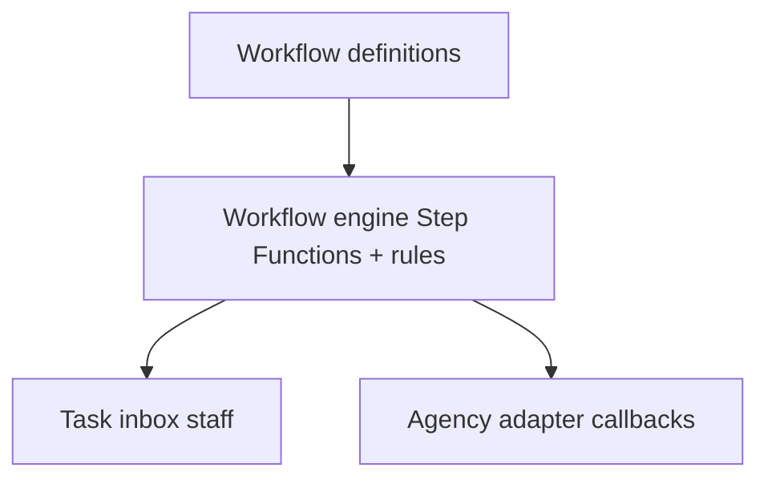
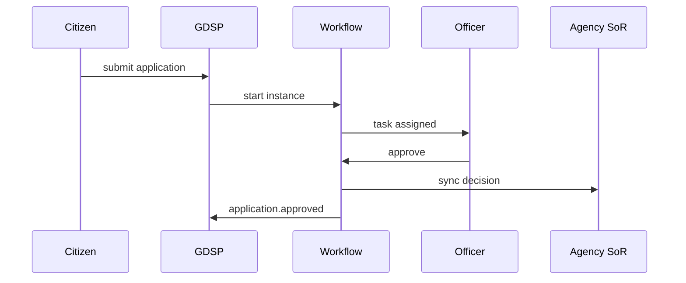

# 03 — Workflow Engine

---

## Executive summary

Configurable **workflow and approval engine** for registrations, permits, licenses, passports, visas, tax, inspections, appeals, complaints—**BPMN-like** definitions with human tasks, timers, escalations, and agency webhooks.

---

## Business purpose

Replace email-based approvals with auditable national process fabric.

---

## Architecture overview

---

## Workflow types

| Template | Agencies |
| --- | --- |
| Business registration | BRELA |
| License approval | Sector regulators |
| Permit issuance | Municipal, TANAPA, NEMC |
| Passport / visa | Immigration |
| Tax registration | TRA |
| Inspection | LATRA, health, fire |
| Appeals / complaints | Ombudsman, courts (future) |
| Procurement | Future |

---

## Sequence: application approval

---

## Approval engine

Maker-checker for high-risk decisions; delegation; acting officer; digital signature step on issuance.

---

## API

`/v1/gov/workflows/*`, `/v1/gov/tasks/*`

---

## Events

`application.created`, `application.submitted`, `application.approved`, `application.rejected`

---

## Security

ABAC: task visible only to org unit with jurisdiction.

---

## AWS

Step Functions standard + express; human tasks in RDS + SNS notify.

---

## Implementation strategy

GDSP-W1 engine + 2 reference workflows.

---

## Future expansion

Cross-agency orchestration (single journey, multiple MDAs).

---

## Cross-references

[04_DOCUMENT_MANAGEMENT.md](04_DOCUMENT_MANAGEMENT.md)
