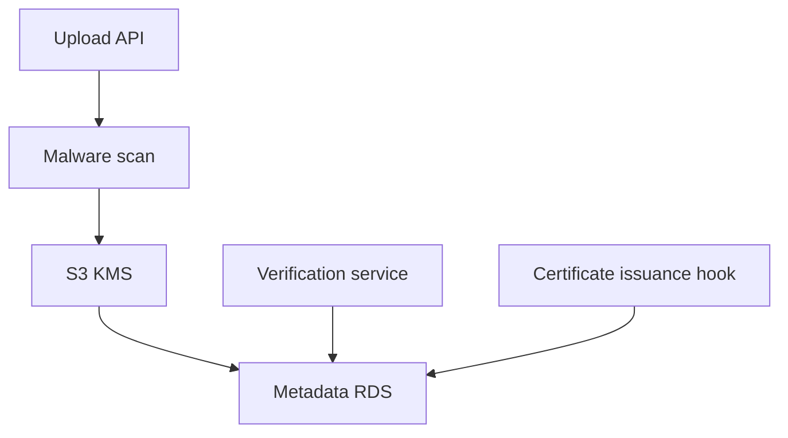
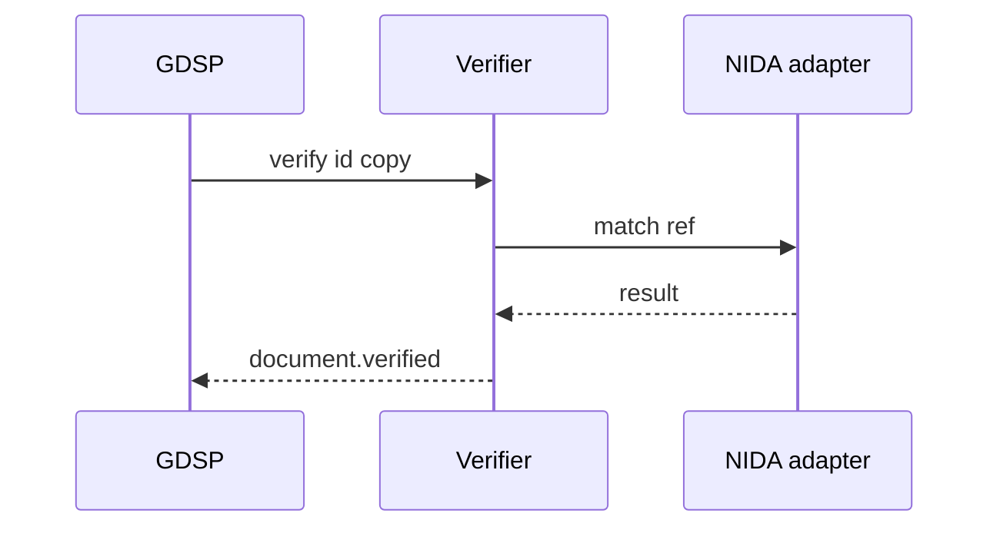

# 04 — Document Management

---

## Executive summary

**Document lifecycle**: upload, virus scan, storage (S3 + Media service), versioning, verification, metadata, retention, archive, digital certificates—linked to applications and inspections.

---

## Business purpose

Trusted evidence chain for government decisions and citizen submissions.

---

## Architecture overview

---

## Capabilities

Document upload · Storage · Versioning · Verification (agency or NIDA match) · Digital certificates · Retention policies · Legal hold · Archive to Glacier.

---

## Digital signatures

Integrate national PKI / approved trust service—GDSP orchestrates signing ceremony; private keys not on GDSP servers.

---

## Sequence: verify document

---

## Retention

Policy per `service_id` and legal schedule; eGA default templates.

---

## API

`/v1/gov/documents/*`

---

## Security

Encryption at rest KMS; access logged to Audit platform.

---

## AWS

S3 Object Lock for immutable records; Macie for sensitive data discovery.

---

## Implementation strategy

Reuse Taifa Media where possible; GDSP owns gov metadata graph.

---

## Future expansion

Blockchain anchoring hash (optional audit).

---

## Cross-references

[10_SECURITY_MODEL.md](10_SECURITY_MODEL.md)
