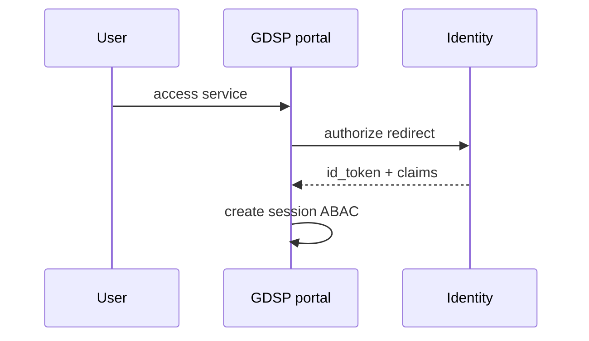

# 05 — Identity Integration

---

## Executive summary

**All authentication via Taifa Identity**—citizen, business, government staff SSO, MFA, RBAC/ABAC; GDSP never stores passwords or issues tokens independently.

---

## Business purpose

One national digital identity layer for government services.

---

## Architecture overview

---

## Personas

| Persona | Identity profile |
| --- | --- |
| Citizen / resident | NIN-linked subject |
| Business | BRELA TIN + authorized reps |
| Visitor | Limited visitor identity |
| Government staff | IdP federation + PIV policy |
| Agent | Delegated access citizen |

---

## Authorization model

- **RBAC:** `gov_officer`, `gov_supervisor`, `agency_admin`, `citizen`  
- **ABAC:** `agency_id`, `jurisdiction`, `service_id`, `clearance_level`  

---

## Sequence: SSO to service

---

## NIDA integration

Verification and attribute release through Identity adapters—not direct NIDA API from GDSP except via Identity broker.

---

## Security

Session binding; step-up MFA for high-risk transactions; staff conditional access.

---

## Operational considerations

Identity outage runbook: read-only catalog, queue submissions.

---

## Implementation strategy

GDSP-I0 OIDC client registration per environment.

---

## Future expansion

eIDAS-style cross-border visitor access.

---

## Cross-references

[platform identity docs](../platform/00_PLATFORM_OVERVIEW.md)
