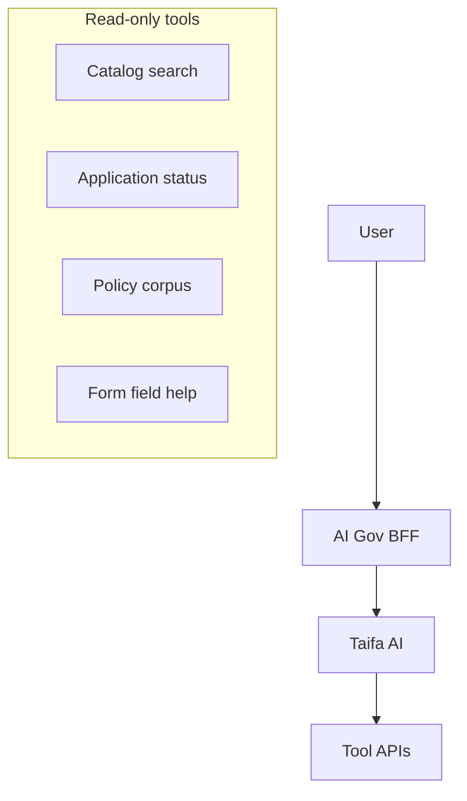
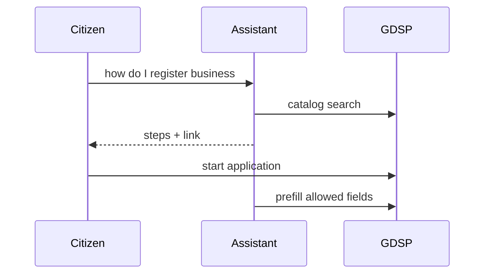

# 06 — AI Government Assistant

---

## Executive summary

**AI Government Assistant**: multilingual (Swahili/English) service discovery, form guidance, regulation explanation, application tracking, document help, policy search—**no autonomous legal decisions or payments**.

---

## Business purpose

Lower barrier to digital government; reduce call center load.

---

## Architecture overview

---

## Capabilities

Find services · Complete forms (guided) · Explain regulations · Track applications · Q&A · Document checklist · Policy RAG · Future voice.

---

## Guardrails

- Cite `service_id` and official URLs  
- No payment card collection (redirect TNPI)  
- Escalate to human agent on low confidence  
- Staff-only tools separated by Identity roles  

---

## Sequence: assisted application

---

## Multilingual

Primary Swahili; English; local language expansion via translation service.

---

## Security

Prompt injection defenses; no PII in training logs; audit prompts for staff mode.

---

## AWS

Bedrock via Taifa AI platform; vector index for policies in OpenSearch (Core Search).

---

## Implementation strategy

Phase 1 FAQ RAG → Phase 2 form copilot → Phase 3 voice.

---

## Future expansion

Proactive eligibility notifications (with consent).

---

## Cross-references

[02_SERVICE_CATALOG.md](02_SERVICE_CATALOG.md)
