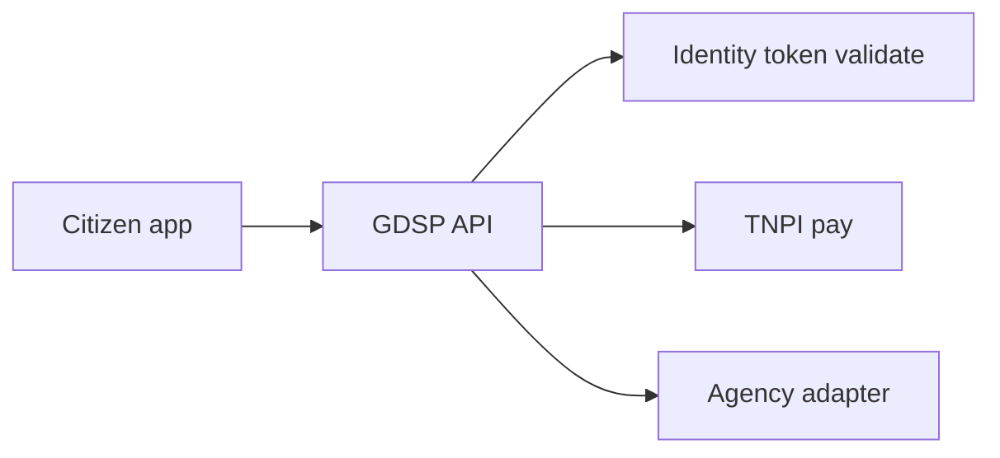

# 07 — API Specification

**Public base:** `https://api.taifa.go.tz/v1/gov` (via Taifa API edge / Developer Platform extension)  
**Payments:** `POST /v1/payments` **TNPI** — metadata `channel: government`

---

## Executive summary

OpenAPI 3.1 for GDSP; agency adapter contracts; no payment capture endpoints on GDSP.

---

## Business purpose

API-first GaaP for portals, mobile, and MDAs.

---

## API groups

### Catalog
`GET /services`, `GET /services/{id}`, `GET /services/search`

### Applications & cases
`POST /applications`, `GET /applications/{id}`, `POST /applications/{id}/submit`, `GET /applications/{id}/status`

### Workflows & tasks
`GET /tasks`, `POST /tasks/{id}/complete`, `GET /workflows/instances/{id}`

### Documents
`POST /documents`, `GET /documents/{id}`, `POST /documents/{id}/verify`

### Appointments
`POST /appointments`, `GET /appointments/{id}`, `DELETE /appointments/{id}`

### Inspections
`POST /inspections`, `POST /inspections/{id}/complete`

### Permits & licenses
`GET /permits/{id}`, `GET /licenses/{id}` (issued artifacts)

### Payments (delegate)
`POST /applications/{id}/pay` → **internal call TNPI** returns `payment_id` + checkout URL

### Feedback
`POST /feedback`, `GET /services/{id}/ratings`

### AI
`POST /assistant/chat`, `POST /assistant/session`

### Agency (B2B)
`POST /agency/v1/callbacks/decision`, `POST /agency/v1/sync` (mTLS)

---

## Payment metadata (TNPI)

```json
{
  "channel": "government",
  "government": {
    "agency_id": "uuid",
    "service_id": "uuid",
    "application_id": "uuid",
    "fee_type": "permit|tax|license|fine",
    "control_number": "optional GEPG ref"
  }
}
```

Use cases: tax, fees, licenses, permits, court, passport, visa, municipal, parking, health, education — [payments/09_GOVERNMENT_PAYMENTS.md](../payments/09_GOVERNMENT_PAYMENTS.md).

---

## API flow



---

## OpenAPI standards

`openapi/gdsp-v1.yaml`; GDS-style versioning; deprecation policy 12 months.

---

## Security

OAuth2 scopes `gov:citizen`, `gov:officer:{agency}`, mTLS for agency adapters.

---

## AWS

API Gateway → ECS Fargate services.

---

## Implementation strategy

Contract-first; agency sandbox tenant per MDA.

---

## Future expansion

NPP national interoperability API profile.

---

## Cross-references

[08_EVENT_CATALOG.md](08_EVENT_CATALOG.md) · [09_DATABASE_MODEL.md](09_DATABASE_MODEL.md)
