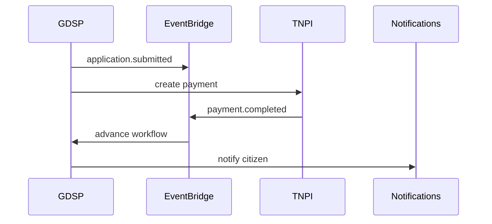

# 08 — Event Catalog

**Topic prefix:** `taifa.government` · **Bus:** `tnpi-platform`

---

## Executive summary

Canonical government platform events for cases, permits, documents, appointments—subscribe to TNPI `payment.*` and Identity lifecycle events.

---

## Business purpose

Event-driven integration between GDSP, agencies, analytics, and notifications.

---

## GDSP publishes

| Event | When |
| --- | --- |
| `service.requested` | User opens service |
| `application.created` | Draft started |
| `application.submitted` | Sent to workflow |
| `application.approved` | Final approval |
| `application.rejected` | Denied |
| `permit.issued` | Artifact generated |
| `license.issued` | License active |
| `document.uploaded` | New evidence |
| `document.verified` | Verification pass |
| `appointment.booked` | Slot reserved |
| `appointment.cancelled` | Slot released |
| `inspection.scheduled` | Field job |
| `inspection.completed` | Result recorded |
| `complaint.filed` | Ombudsman path |
| `feedback.submitted` | Service rating |

---

## GDSP subscribes

| Event | Source | Action |
| --- | --- | --- |
| `payment.completed` | TNPI | Advance workflow fee step |
| `payment.failed` | TNPI | Notify citizen |
| `identity.verified` | Identity | Unlock service |
| `transport.*` | TNMP/TPP | Mobility-linked permits only |

---

## Sequence

---

## Security

No secrets in payloads; agency events signed.

---

## AWS

Schema registry; archival for audit 7y+.

---

## Implementation strategy

GDSP-E0 schema bootstrap.

---

## Future expansion

National data exchange bus (NDEB) federation.

---

## Cross-references

[payments/15_EVENT_CATALOG.md](../payments/15_EVENT_CATALOG.md)
