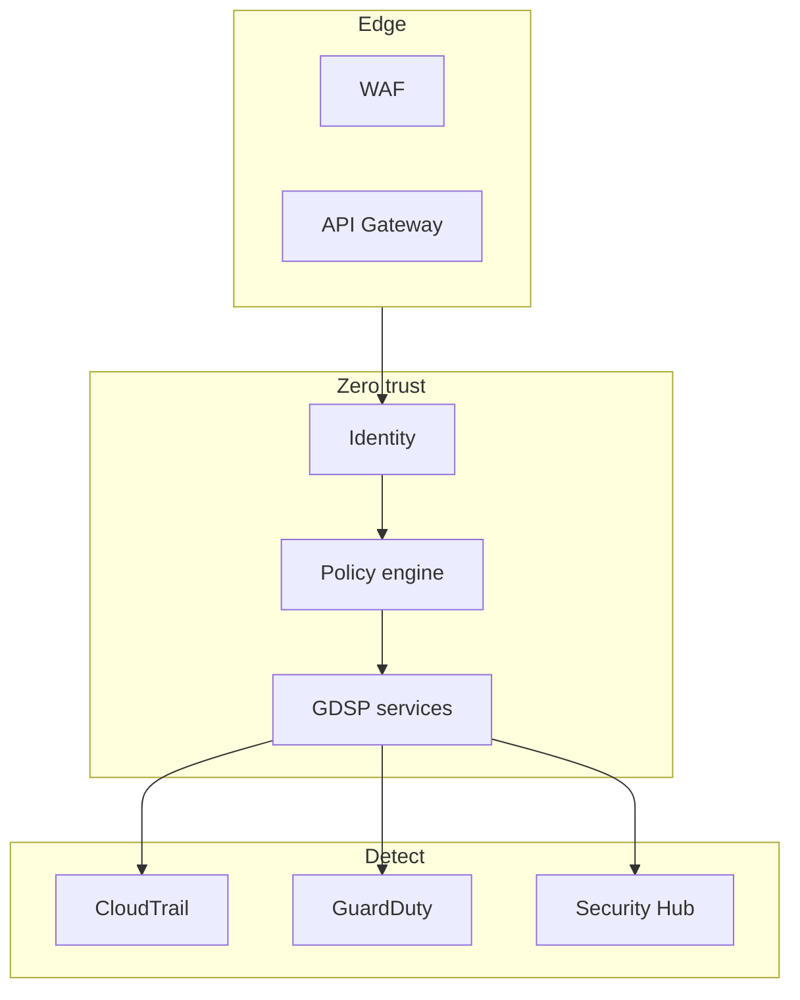
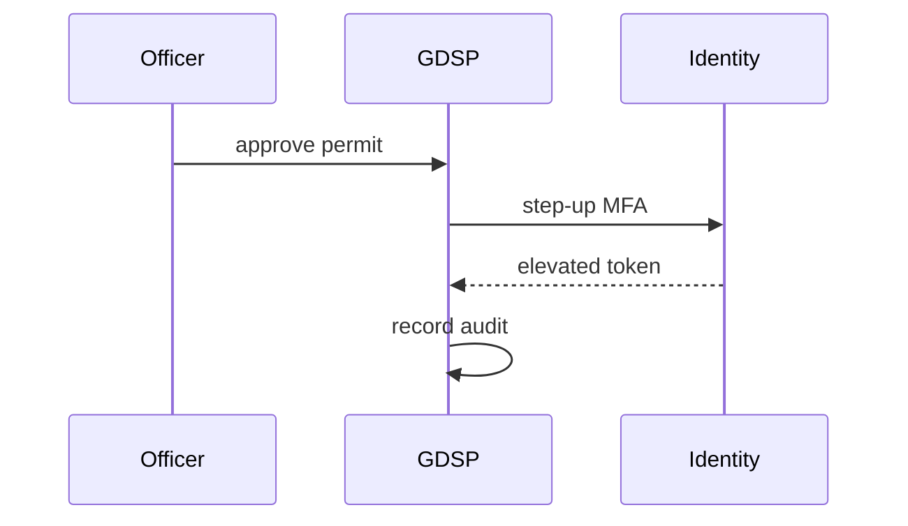

# 10 — Security Model

---

## Executive summary

**Zero-trust** government security: Identity SSO, MFA, RBAC/ABAC, mTLS agency adapters, KMS, immutable audit, GuardDuty, classification handling, staff vs citizen separation.

---

## Business purpose

Protect national data and maintain public trust.

---

## Security architecture

---

## Controls

| Control | Implementation |
| --- | --- |
| Authentication | Taifa Identity only |
| Authorization | RBAC + ABAC |
| Encryption | TLS 1.3, KMS at rest |
| Agency integration | mTLS + signed webhooks |
| Audit | Core Audit platform append-only |
| Data residency | Tanzania region policy |
| Staff access | PAM, MFA, IP allowlist optional |

---

## Classification

Public · Official · Confidential · Secret (national policy alignment).

---

## TNPI / TNMP

Payment pages hosted TNPI components; mobility permits call TNMP APIs with scoped tokens.

---

## Sequence: high-risk action

---

## Operational considerations

SOC playbook; breach notification to eGA/CERT.

---

## Implementation strategy

Security baseline GDSP-S0 before any prod agency.

---

## Future expansion

HSM for signing service.

---

## Cross-references

[05_IDENTITY_INTEGRATION.md](05_IDENTITY_INTEGRATION.md)
