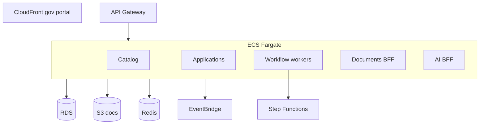
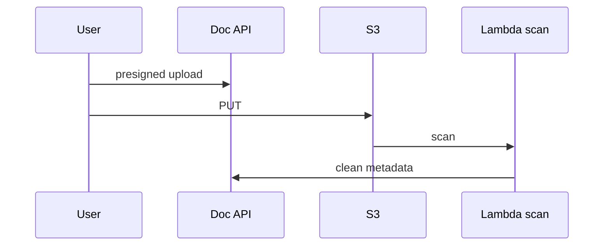

# 11 — AWS Architecture

---

## Executive summary

GDSP production on AWS: **CloudFront** portal, **Route53**, **API Gateway**, **ECS Fargate**, **Lambda**, **Step Functions** (workflows), **EventBridge**, **SQS/SNS**, **RDS PostgreSQL**, **Redis**, **S3**, **CloudWatch**, **CloudTrail**, **KMS**, **Backup**, **GuardDuty**, **Security Hub**.

---

## Business purpose

Multi-tenant national scale with agency isolation and DR.

---

## Architecture overview

---

## Multi-tenancy

`organization_id` partition; optional dedicated VPC per high-security agency (courts).

---

## TNPI / Identity

PrivateLink or VPC peering to platform services; no public TNPI keys in GDSP.

---

## Sequence: document upload

---

## DR

Multi-AZ; cross-region backup; RPO 15m government target.

---

## Operational considerations

Cost allocation tags per agency; autoscale on tax season.

---

## Implementation strategy

Terraform `taifa-government`; landing zone from Taifa Core.

---

## Future expansion

Air-gapped disaster recovery site.

---

## Cross-references

[12_IMPLEMENTATION_GUIDE.md](12_IMPLEMENTATION_GUIDE.md)
