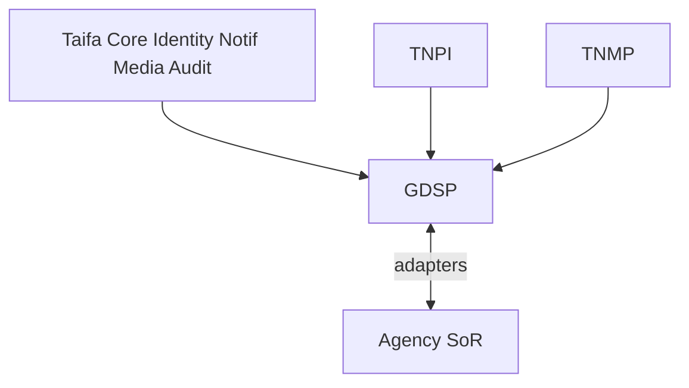

# 12 — Implementation Guide

---

## Executive summary

Deliver GDSP in waves: **platform shell** → **pilot MDA** → **horizontal expansion** → **national catalog**—always Identity + TNPI integration first.

---

## Business purpose

De-risk government transformation with reusable GaaP.

---

## Dependency graph

---

## Service decomposition

| Service | Role |
| --- | --- |
| `gov-catalog` | Service index |
| `gov-applications` | Cases |
| `gov-workflow` | BPM + tasks |
| `gov-documents` | Metadata + S3 |
| `gov-appointments` | Booking |
| `gov-inspections` | Field ops |
| `gov-adapter-gateway` | MDA mTLS |
| `gov-ai-bff` | Assistant |
| `gov-analytics` | Dashboards |

---

## Integration checklist (per agency)

- [ ] Identity federation / officer roles  
- [ ] TNPI fee codes + GEPG if applicable  
- [ ] Adapter mTLS cert  
- [ ] Workflow template signed off  
- [ ] Retention policy  
- [ ] UAT sign-off  

---

## Payments rule

Every fee path: GDSP creates `PaymentInstruction` → TNPI Developer API → webhook → workflow gate.

---

## Mobility rule

LATRA/municipal transport permits: TNMP APIs for operator data; fees via TNPI.

---

## Testing

Synthetic citizen journey CI; agency adapter contract tests; pen test per wave.

---

## Implementation strategy

See [GDSP_GATE_PACKAGE.md](GDSP_GATE_PACKAGE.md) and [14_BACKLOG.md](14_BACKLOG.md).

---

## Future expansion

Shared procurement module.

---

## Cross-references

[17_GOVERNMENT_INTEGRATION_GUIDE.md](17_GOVERNMENT_INTEGRATION_GUIDE.md)
