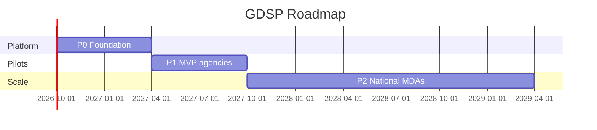

# 13 — Roadmap

---

## Executive summary

**National Digital Government Roadmap**: platform foundation (Y1) → sector pilots (Y1–2) → scale MDAs & LGAs (Y3–5) → full GaaP maturity (Y5+).

---

## Business purpose

Align GDSP delivery with eGA and cabinet digital priorities.

---

## Phase overview

| Phase | Timeline | Focus |
| --- | --- | --- |
| **P0** | Mo 1–6 | Catalog, apps, workflow, Identity, TNPI pay |
| **P1** | Mo 7–12 | MVP agencies (see gate package) |
| **P2** | Y2 | TRA, BRELA, Immigration, RITA |
| **P3** | Y3 | Municipal councils, LATRA, TANAPA |
| **P4** | Y4 | Health/education fees, courts |
| **P5** | Y5+ | AI voice, cross-border, procurement |

---

## MVP (see gate §4)

Single portal + 3–5 high-volume services + 1–2 MDAs live.

---

## National rollout strategy

- **Horizontal first:** catalog, workflow, documents for all  
- **Vertical slices:** one agency end-to-end before next  
- **LGA template:** municipal tenant clone  
- **Metrics:** digital uptake %, SLA compliance, TNPI collection volume  

---

## Gantt (indicative)

---

## Operational considerations

Change management; training for 10k+ officers.

---

## Implementation strategy

[14_BACKLOG.md](14_BACKLOG.md) tagged GSB-*.

---

## Future expansion

East Africa digital government corridor.

---

## Cross-references

[GDSP_GATE_PACKAGE.md](GDSP_GATE_PACKAGE.md)
