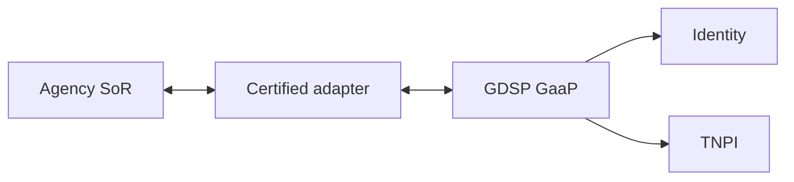
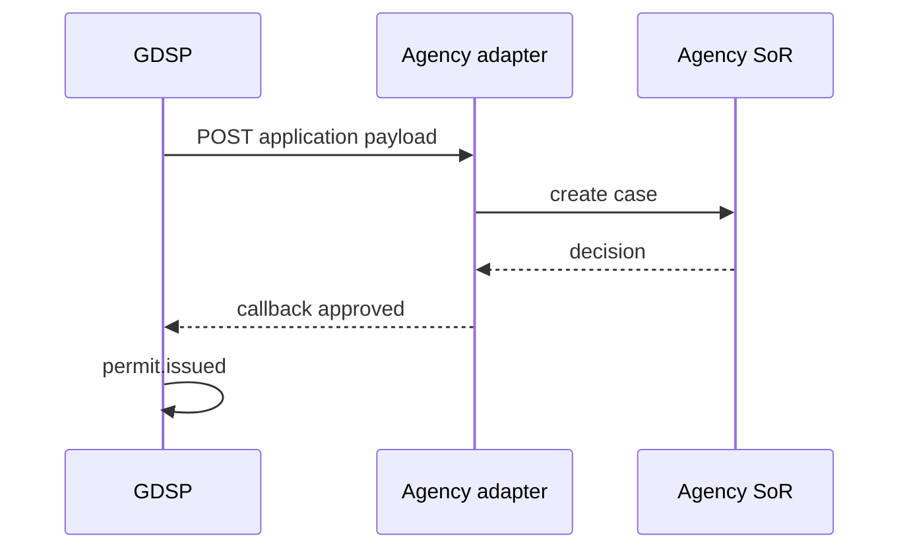

# 17 — Government Integration Guide

---

## Executive summary

How **ministries, agencies, and LGAs** integrate with GDSP: onboarding, adapters, Identity, TNPI, events, testing, and go-live.

---

## Business purpose

Repeatable integration factory—not one-off projects per MDA.

---

## Integration architecture

---

## Onboarding steps

1. **MoU / data sharing** with eGA  
2. **Organization** registered in GDSP  
3. **Service definitions** published to catalog  
4. **Workflow** template configured  
5. **Identity** roles for officers mapped  
6. **TNPI** merchant/agency fee codes + settlement account  
7. **Adapter** deployed (mTLS) with sandbox UAT  
8. **Events** subscribed (payment.completed, application.*)  
9. **Pen test** + go-live approval  

---

## Adapter contract

- REST callbacks: decision, status sync  
- Idempotency-Key required  
- Signed payloads `X-Taifa-Signature`  
- Timeout 30s; retry policy documented  

---

## GEPG / legacy

Bill verification via TNPI government adapter—GDSP passes `control_number`; no direct float.

---

## TNMP

Transport permits: fetch operator/vehicle validity from TNMP; payment still TNPI.

---

## Sequence: agency decision

---

## Testing

Sandbox tenant; synthetic NIN test subjects from Identity; TNPI sandbox payments.

---

## Security

Adapter IP allowlist; cert rotation 12 months.

---

## Support model

L1 citizen helpdesk · L2 GDSP ops · L3 agency IT.

---

## Implementation strategy

Use integration checklist in [12_IMPLEMENTATION_GUIDE.md](12_IMPLEMENTATION_GUIDE.md).

---

## Future expansion

National API gateway federation for cross-border services.

---

## Cross-references

[01_GOVERNMENT_PLATFORM.md](01_GOVERNMENT_PLATFORM.md) · [07_API_SPECIFICATION.md](07_API_SPECIFICATION.md)
