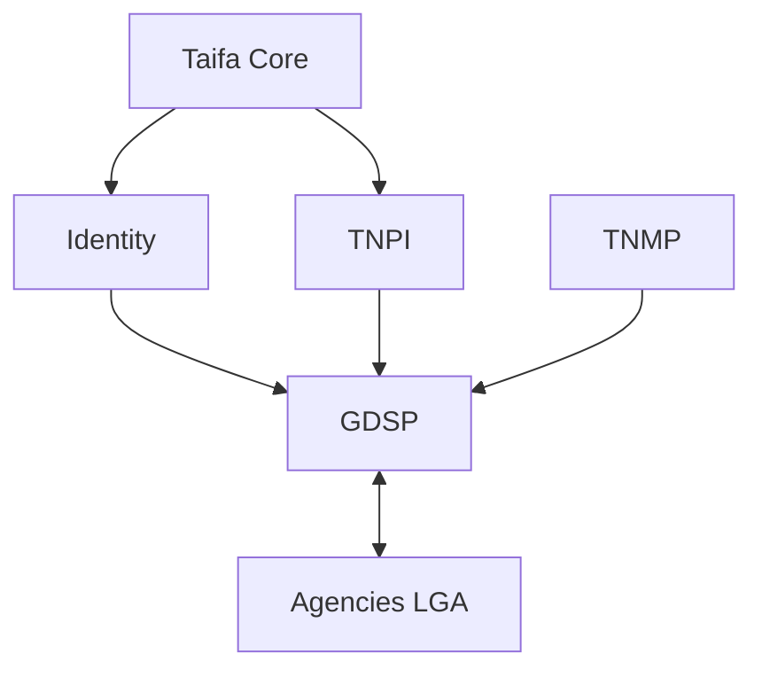

# GDSP — Gate Package

**Product:** Taifa Government Digital Services Platform (GDSP)  
**Model:** Government-as-a-Platform (GaaP)  
**Status:** Architecture planning complete — Taifa Core, TNPI, TNMP assumed available  
**Date:** 2026-08-06

---

## 1. Product Readiness Report

### Executive summary

The **GDSP** pack (`docs/government/00–18`) defines Tanzania’s **Government-as-a-Platform**: shared catalog, applications, workflows, documents, appointments, inspections, and agency adapters—**Identity for auth**, **TNPI for all payments**, **TNMP for mobility-linked services**—without duplicating those platforms.

### Readiness matrix

| Dimension | Status |
| --- | --- |
| Business architecture, taxonomy, domain, context map | ✅ |
| Catalog, workflow, documents, Identity, AI | ✅ |
| APIs, events, ER, security, AWS | ✅ |
| Integration guide, roadmap, backlog, acceptance | ✅ |
| **Implementation** | ⬜ |
| **Identity prod federation** | ⬜ |
| **TNPI gov payment rails** | ✅ design ([09_GOVERNMENT_PAYMENTS](../payments/09_GOVERNMENT_PAYMENTS.md)) |

### Verdict

| Question | Answer |
| --- | --- |
| Start GDSP **implementation**? | **Yes** (architecture) |
| Build separate citizen login? | **No** |
| Build payment engine? | **No** |

---

## 2. Architecture Review Report

### Scope

GaaP boundaries; agency SoR; zero trust; TNPI/Identity conformance; AI safety; multi-tenant LGAs.

### Findings

| ID | Finding | Severity | Action |
| --- | --- | --- | --- |
| AR-G-01 | No auth outside Identity | Critical | ADR-GDSP-001 |
| AR-G-02 | No fees outside TNPI | Critical | ADR-GDSP-002 |
| AR-G-03 | Agency adapter trust | Critical | mTLS GSB-026 |
| AR-G-04 | PII in AI logs | High | Redaction policy |
| AR-G-05 | Workflow vs legal record | High | ADR-GDSP-003 training |
| AR-G-06 | GEPG dual path confusion | Med | Single TNPI adapter doc |
| AR-G-07 | TNMP only for mobility data | Med | Integration guide §TNMP |

### Verdict

**Approved to implement GDSP P0** when Identity OIDC client and TNPI government payment metadata schema are frozen.

---

## 3. Sprint Breakdown

| Sprint | Duration | Focus | Backlog |
| --- | --- | --- | --- |
| **GS-P0a** | 3 wk | IaC, Identity, audit, mTLS gateway | GSB-001–002, 026–027 |
| **GS-P0b** | 4 wk | Catalog, applications, events | GSB-004–005, 008 |
| **GS-P0c** | 4 wk | Workflow, TNPI webhooks, documents | GSB-003, 006–007 |
| **GS-P1a** | 4 wk | Citizen portal, officer inbox | GSB-009–010 |
| **GS-P1b** | 4 wk | Municipal permit MVP + adapter | GSB-011, 014 |
| **GS-P1c** | 3 wk | BRELA/TRA stubs, AI FAQ | GSB-012–013, 020 |
| **GS-P2** | 12 wk | Scale MDAs LATRA TANAPA RITA Immigration | GSB-015–019, 028 |
| **GS-P3** | 12 wk | LGA tenants, feedback, courts | GSB-022–025 |

**P0–P1 MVP:** ~22 weeks.

---

## 4. MVP Definition

**Name:** GDSP MVP — “Digital Municipal Services + Platform Core”

**Duration:** Months 7–12 after P0 (calendar aligned to [13_ROADMAP.md](13_ROADMAP.md))

**In scope**

- National **service catalog** (≥20 published services metadata)  
- **Identity** citizen + officer SSO, MFA for approvals  
- **Applications** draft → submit → pay → review → issue  
- **Workflow** engine with municipal permit + business registration stub templates  
- **TNPI** fee payment on application (sandbox → prod pilot)  
- **Documents** upload + virus scan  
- **Notifications** via Taifa Core  
- **Pilot:** 1–2 municipal councils (e.g. Dar + secondary city)  
- **Pilot:** BRELA name reservation stub OR TRA TIN payment reference journey (one vertical)  
- **AI assistant** FAQ on catalog (Swahili/English)  

**Out of scope MVP**

- Full Immigration passport production  
- National procurement  
- Voice AI  
- Custom per-agency portals (use shared portal)  

**Success metrics (12 months)**

- 50k registered citizen journeys  
- 10k TNPI government payments via GDSP  
- ≥80% applications digital end-to-end (pilot councils)  
- Officer task SLA 5 days median  
- Zero Identity/TNPI logic in GDSP repo (audit)  

---

## 5. Government Adoption Strategy

### Governance

- **Sponsor:** eGA + Ministry of State (Digital)  
- **Steering:** quarterly MDA + LGA CIO forum  
- **Standards:** mandatory API-first for new digital services  

### Adoption tiers

| Tier | Institutions | Approach |
| --- | --- | --- |
| **T1 Champions** | Pilot LGAs, BRELA, TRA | Co-build adapters |
| **T2 Regulators** | LATRA, TANAPA, NEMC, EWURA, TMDA | Catalog + fees via TNPI |
| **T3 Justice/safety** | Courts, police, fire | Hardened VPC tier |
| **T4 Social** | Hospitals, schools, universities | Fee bundles + appointments |
| **T5 Long tail** | Future agencies | Self-service integration kit |

### Change management

- Train **Digital Service Officers** per agency  
- **Reuse mandate:** no new payment gateway projects  
- **Incentives:** central funding for adapter certification  
- **Metrics published:** digital uptake league table (eGA)  

### Technical adoption

- Sandbox per agency on GDSP  
- Certification: security + UAT + TNPI test payments  
- TNMP linked services for transport permits only  

---

## 6. National Digital Government Roadmap

### Horizon 1 (Years 1–2): Platform + pilots

P0 shared GaaP · MVP municipal · TRA/BRELA slices · event bus national  

### Horizon 2 (Years 3–4): Scale

Immigration, RITA, LATRA, TANAPA live · 26+ LGAs on tenant template · inspections national · gov analytics dashboard  

### Horizon 3 (Year 5): Consolidation

Courts, police, health/education fees · AI form copilot · cross-agency single journey (business + tax + license)  

### Horizon 4 (Years 6–10): Maturity

Procurement module · voice assistant · open data · regional interoperability · 90% digital-by-default for tier-1 services  

### Dependency graph

---

## Cross-references

[00_PLATFORM_OVERVIEW.md](00_PLATFORM_OVERVIEW.md) · [mobility/00_PLATFORM_OVERVIEW.md](../mobility/00_PLATFORM_OVERVIEW.md)
