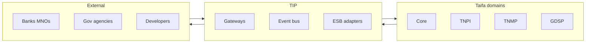

# Taifa Integration Platform (TIP) — Overview

**Product:** Taifa Integration Platform (TIP)  
**Bounded context:** `platform.integration`  
**Status:** Architecture & implementation planning — **no production code**  
**Role:** **National digital integration backbone** — not a business application

---

## Executive summary

**TIP** is Tanzania’s enterprise integration infrastructure: API gateways, partner edge, event bus, messaging, webhooks, ESB adapters, transformation, security, observability, and marketplace—so **every Taifa platform and every external partner** integrates through one governed layer (patterns: Kong, Apigee, MuleSoft, AWS API Gateway, EventBridge).

---

## Mission

```
Taifa platforms (Core, TNPI, TNMP, GDSP, …) + External partners (banks, MNOs, MDAs, …)
        → TIP (gateway, bus, flows, adapters) → Domain systems
```

**TIP does not** implement payments, government cases, mobility logic, or identity issuance—it **routes, secures, transforms, and observes**.

---

## Relationship to existing platforms

| Platform | Relationship to TIP |
| --- | --- |
| [Taifa Core](../platform/00_PLATFORM_OVERVIEW.md) | TIP **evolves** Core API Gateway & event fabric into national scope |
| [Developer Platform](../payments/developer-platform/00_INDEX.md) | **DX layer** (docs, SDKs, partner UX) on TIP runtime |
| [TNPI](../payments/00_PAYMENT_PROGRAM.md) | Domain APIs **published through** TIP |
| [TNMP](../mobility/00_PLATFORM_OVERVIEW.md) | Domain APIs **published through** TIP |
| [GDSP](../government/00_PLATFORM_OVERVIEW.md) | Agency adapters **terminate at** TIP partner gateway |
| Taifa Identity | **Token validation** at edge (conformist) |
| Core Audit | **Immutable audit** sink for integration actions |

---

## Capability map

| Capability | TIP component |
| --- | --- |
| Enterprise API Gateway | Internal + north-south routing |
| Partner Gateway | External B2B edge (mTLS, contracts) |
| API management | Products, plans, keys, OAuth clients |
| Event bus | EventBridge canonical + catalog |
| Message broker | SQS/SNS patterns; Kafka future |
| Service mesh | ECS/App Mesh east-west (mTLS, policy) |
| ESB adapter layer | Protocol/map/transform to legacy |
| Webhook platform | Outbound delivery, verify, DLQ |
| Integration flows | Step Functions + Fargate workers |
| OpenAPI management | Registry, versioning, lint CI |
| API marketplace | Discover/subscribe partner APIs |
| Sandbox & testing | Virtual partners, contract tests |
| Observability | Metrics, traces, integration monitoring |
| Secrets & certificates | KMS, Secrets Manager, ACM rotation |

---

## Context map



---

## Supported protocols

REST · GraphQL (federated BFF) · Webhooks · async events · SQS · SNS · EventBridge · gRPC (internal) · Kafka *(future)* · MQTT *(future IoT)*

---

## Document map

| # | Document |
| --- | --- |
| Gate | [TIP_GATE_PACKAGE.md](TIP_GATE_PACKAGE.md) |
| 01 | [01_PRODUCT_VISION.md](01_PRODUCT_VISION.md) |
| 02 | [02_ENTERPRISE_API_GATEWAY.md](02_ENTERPRISE_API_GATEWAY.md) |
| 03 | [03_PARTNER_GATEWAY.md](03_PARTNER_GATEWAY.md) |
| 04 | [04_EVENT_BUS.md](04_EVENT_BUS.md) |
| 05 | [05_MESSAGE_BROKER.md](05_MESSAGE_BROKER.md) |
| 06 | [06_WEBHOOK_PLATFORM.md](06_WEBHOOK_PLATFORM.md) |
| 07 | [07_INTEGRATION_FLOWS.md](07_INTEGRATION_FLOWS.md) |
| 08 | [08_ESB_ADAPTER_LAYER.md](08_ESB_ADAPTER_LAYER.md) |
| 09 | [09_API_SECURITY.md](09_API_SECURITY.md) |
| 10 | [10_OPENAPI_MANAGEMENT.md](10_OPENAPI_MANAGEMENT.md) |
| 11 | [11_SERVICE_MESH.md](11_SERVICE_MESH.md) |
| 12 | [12_API_MARKETPLACE.md](12_API_MARKETPLACE.md) |
| 13 | [13_SANDBOX_TESTING.md](13_SANDBOX_TESTING.md) |
| 14 | [14_OBSERVABILITY.md](14_OBSERVABILITY.md) |
| 15 | [15_API_SPECIFICATION.md](15_API_SPECIFICATION.md) |
| 16 | [16_EVENT_CATALOG.md](16_EVENT_CATALOG.md) |
| 17 | [17_DATABASE_MODEL.md](17_DATABASE_MODEL.md) |
| 18 | [18_SECURITY_MODEL.md](18_SECURITY_MODEL.md) |
| 19 | [19_AWS_ARCHITECTURE.md](19_AWS_ARCHITECTURE.md) |
| 20 | [20_IMPLEMENTATION_GUIDE.md](20_IMPLEMENTATION_GUIDE.md) |
| 21 | [21_ROADMAP.md](21_ROADMAP.md) |
| 22 | [22_BACKLOG.md](22_BACKLOG.md) |
| 23 | [23_ACCEPTANCE_CRITERIA.md](23_ACCEPTANCE_CRITERIA.md) |
| 24 | [24_DEFINITION_OF_DONE.md](24_DEFINITION_OF_DONE.md) |
| 25 | [25_RISK_REGISTER.md](25_RISK_REGISTER.md) |

---

## Cross-references

[Architecture Constitution](../architecture/00_ARCHITECTURE_CONSTITUTION.md) · [GOVERNANCE](../GOVERNANCE.md) · [Core API Gateway](../platform/02_API_GATEWAY_PLATFORM.md)
