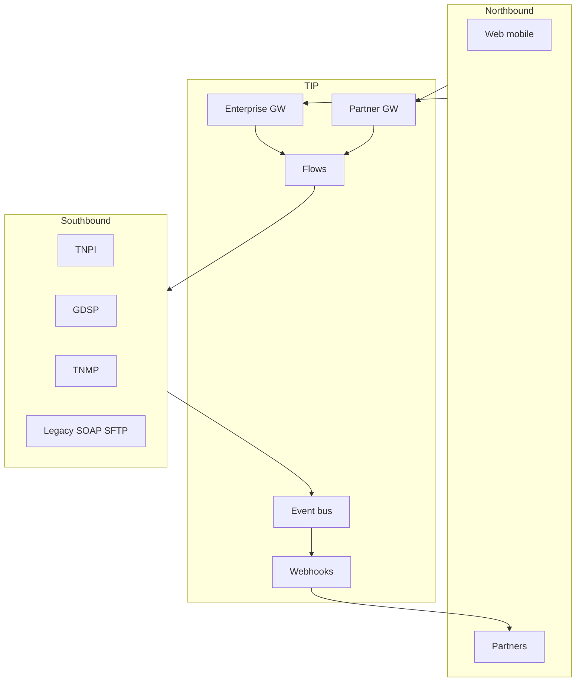
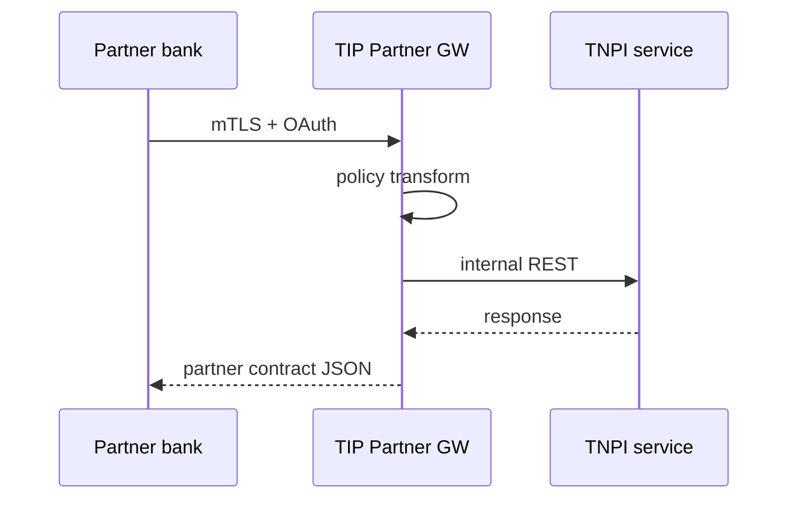

# 01 — Product Vision

---

## Executive summary

**TIP** makes Tanzania’s digital state **interoperable by default**: one backbone for APIs, events, and partner connectivity—analogous to national DPI integration layers (India UPI stack patterns) with enterprise iPaaS discipline (MuleSoft/Kong/Apigee).

---

## Business purpose

Eliminate point-to-point integrations; reduce breach surface; accelerate partner onboarding; enable observability and policy at scale.

---

## Architecture overview

---

## Vision

**Every connection governed—every message traced—every partner certified.**

---

## Design principles

API-first · Zero trust · Event-driven · Open standards (OpenAPI, CloudEvents) · Fail closed on auth · Idempotent consumers · Versioned contracts · Sandbox parity · No business logic in integration tier.

---

## Domain model (integration)

| Entity | Role |
| --- | --- |
| `APIProduct` | Published capability bundle |
| `APIPlan` | Rate/quota tier |
| `Consumer` / `Partner` | External org |
| `Credential` | Key, OAuth client, cert |
| `Route` | GW mapping |
| `EventChannel` | Bus topic/rule |
| `Flow` | Orchestrated integration |
| `Adapter` | ESB connector |
| `WebhookSubscription` | Outbound config |
| `ContractTest` | CI artifact |

---

## Sequence: partner calls TNPI via TIP

---

## Security

OAuth2/OIDC, API keys, mTLS — [09_API_SECURITY.md](09_API_SECURITY.md).

---

## AWS

[19_AWS_ARCHITECTURE.md](19_AWS_ARCHITECTURE.md).

---

## Implementation strategy

[21_ROADMAP.md](21_ROADMAP.md) · [TIP_GATE_PACKAGE.md](TIP_GATE_PACKAGE.md).

---

## Future expansion

National event exchange with EAC partners; Kafka mesh for analytics.

---

## Cross-references

[02_ENTERPRISE_API_GATEWAY.md](02_ENTERPRISE_API_GATEWAY.md)
