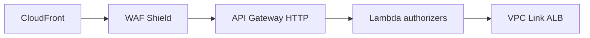
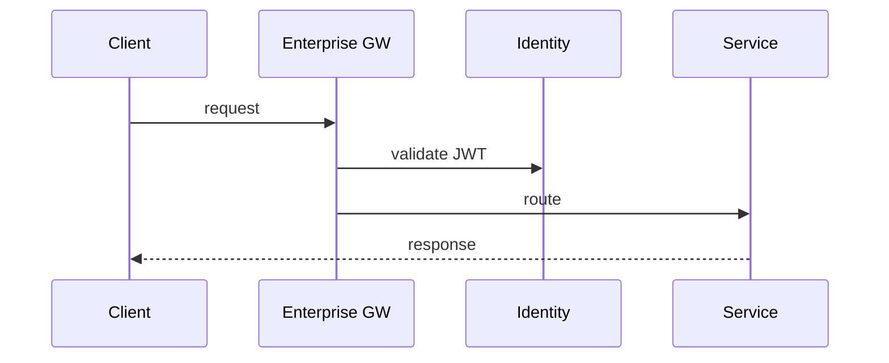

# 02 — Enterprise API Gateway

---

## Executive summary

**Enterprise API Gateway** for all Taifa north-south traffic: routing, authN/Z passthrough, validation, versioning, throttling, WAF, CloudFront—implements and extends [Core API Gateway](../platform/02_API_GATEWAY_PLATFORM.md).

---

## Business purpose

Single internal front door before service mesh east-west hops.

---

## Architecture overview

---

## Features

REST/GraphQL ingress · OpenAPI validation · API versioning (`/v1`, headers) · rate limit & throttle · request/response transformation (mapping templates) · correlation `X-Taifa-Request-Id` · W3C trace context · mutual TLS for selected routes.

---

## API products (examples)

`taifa.core.*` · `taifa.payments.*` · `taifa.mobility.*` · `taifa.government.*`

---

## Sequence

---

## Operational considerations

Multi-account deployment; separate staging/prod APIs; blue/green stages.

---

## Implementation strategy

TIP-G1 gateway foundation sprint.

---

## Future expansion

GraphQL federation gateway.

---

## Cross-references

[10_OPENAPI_MANAGEMENT.md](10_OPENAPI_MANAGEMENT.md)
