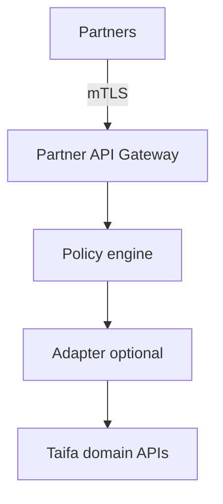
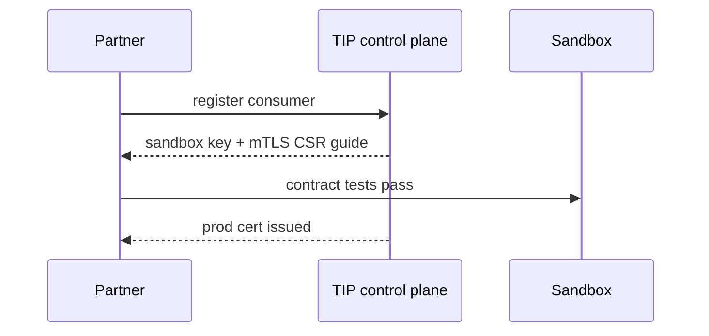

# 03 — Partner Gateway

---

## Executive summary

**Partner Gateway** (B2B edge): banks, MNOs, insurers, airlines, hotels, health, education, municipalities, developers—mTLS, contractual API products, stricter WAF, dedicated usage plans.

---

## Business purpose

Isolate partner blast radius from citizen-facing enterprise gateway.

---

## Architecture overview

---

## Partner onboarding

Register org → legal agreement → sandbox credentials → certification tests → production mTLS cert → API product subscription — extends [Developer Platform](../payments/developer-platform/17_PARTNER_ONBOARDING.md) with **TIP runtime enforcement**.

---

## Supported partner classes

Government agencies · Banks · Mobile money · Insurance · Airlines · Hotels · Tourism · Healthcare · Schools · Universities · Municipalities · ISVs.

---

## Sequence: onboarding

---

## Analytics

Per-partner latency, error rate, quota consumption — [14_OBSERVABILITY.md](14_OBSERVABILITY.md).

---

## Security

[09_API_SECURITY.md](09_API_SECURITY.md) · certificate management ACM Private CA.

---

## Implementation strategy

TIP-P1 partner GW after enterprise GW.

---

## Future expansion

API marketplace billing (TNPI for fees).

---

## Cross-references

[12_API_MARKETPLACE.md](12_API_MARKETPLACE.md)
