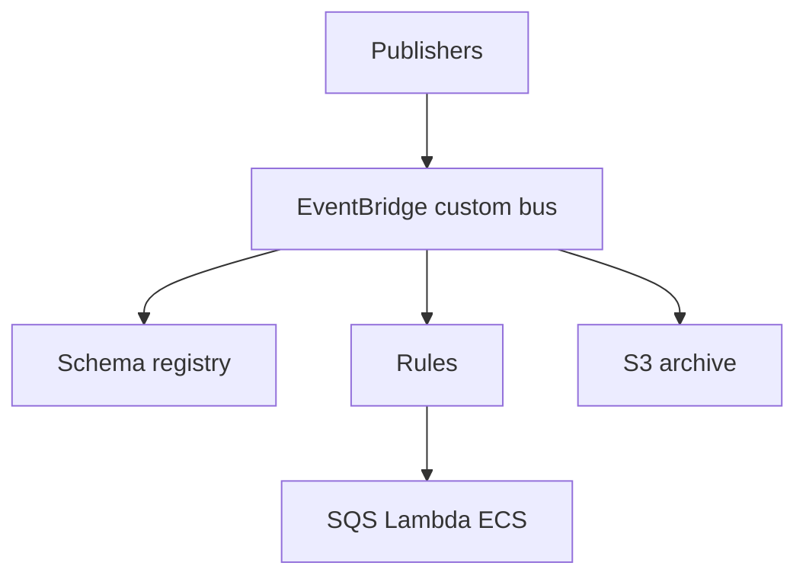
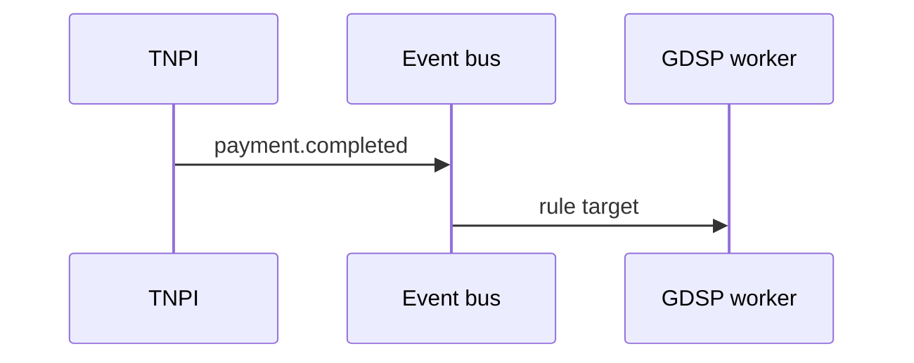

# 04 — Event Bus

---

## Executive summary

National **event bus** on **Amazon EventBridge** with canonical catalog, schema registry, replay archives, and cross-account buses—unifies `taifa.*` domain events from TNPI, TNMP, GDSP, Core.

---

## Business purpose

Loose coupling and auditable async integration across the ecosystem.

---

## Architecture overview

---

## Event catalog governance

Naming: `taifa.{domain}.{entity}.{action}` · CloudEvents 1.0 envelope · version field mandatory — [16_EVENT_CATALOG.md](16_EVENT_CATALOG.md).

---

## Integration with domain catalogs

Merge TNPI, mobility, government event docs into **TIP master index** (not duplicate payloads).

---

## Sequence

---

## Future Kafka

High-volume analytics tap via EventBridge → Kafka (MSK) for data platform only; operational bus remains EventBridge v1.

---

## Security

IAM boundaries; no PII in event detail without classification tag.

---

## AWS

EventBridge scheduler; dead-letter queues per rule.

---

## Implementation strategy

TIP-E0 bus + registry.

---

## Cross-references

[05_MESSAGE_BROKER.md](05_MESSAGE_BROKER.md)
