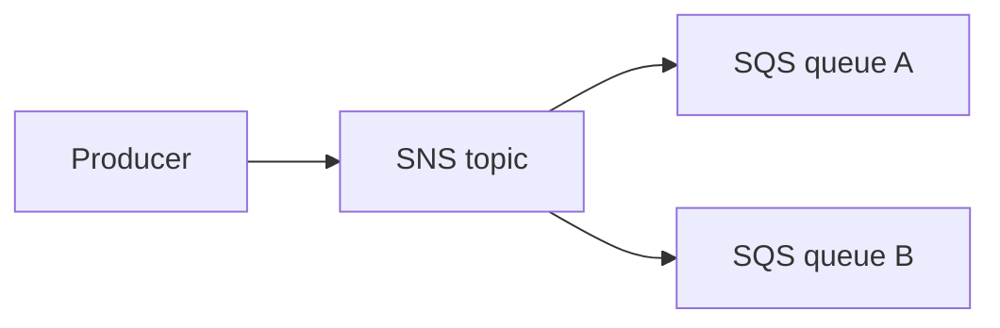

# 05 — Message Broker

---

## Executive summary

**Message broker patterns** using **SQS** (work queues), **SNS** (fan-out), and EventBridge for routing—idempotent consumers, DLQ, poison message handling.

---

## Business purpose

Reliable async delivery when synchronous APIs are insufficient.

---

## Architecture overview

---

## Patterns

| Pattern | Use |
| --- | --- |
| Queue | Webhook delivery, adapter jobs |
| Topic | Multi-subscriber notifications |
| FIFO | Ordered partner file processing |
| DLQ | Failed message inspection |

---

## Protocol translation entry

Messages may trigger [08_ESB_ADAPTER_LAYER.md](08_ESB_ADAPTER_LAYER.md) workers.

---

## MQTT future

IoT Core → rules → EventBridge for smart city / fleet telematics at scale.

---

## Operational considerations

Visibility timeout tuning; max receive count 5 default.

---

## Implementation strategy

Standardize queue naming `tip-{env}-{domain}-{purpose}`.

---

## Cross-references

[06_WEBHOOK_PLATFORM.md](06_WEBHOOK_PLATFORM.md)
