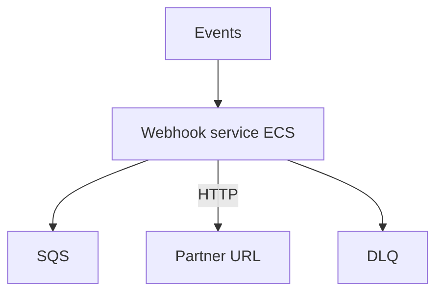
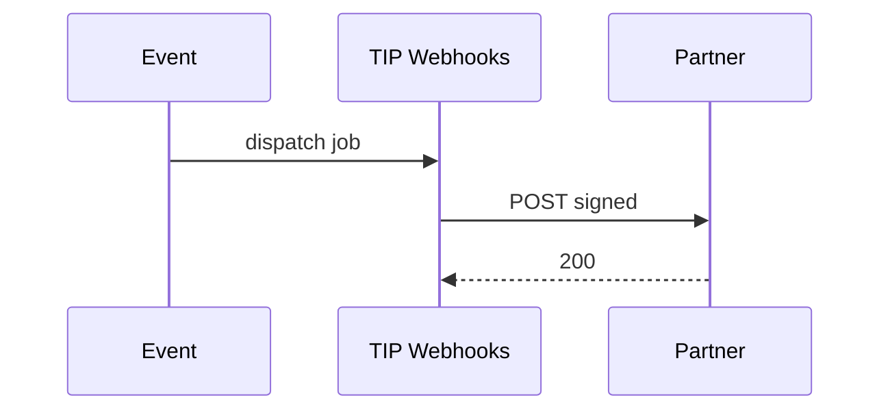

# 06 — Webhook Platform

---

## Executive summary

Central **webhook platform** (consolidates partner outbound patterns from Developer Platform): registration API, HMAC verification docs, retries, DLQ, delivery logs, replay protection—runtime owned by TIP.

---

## Business purpose

One implementation for TNPI, GDSP, and partner notifications.

---

## Architecture overview

---

## Features

Webhook registration · signature validation · retry policy · versioning · event filtering · delivery logs · replay (audited).

---

## Developer portal integration

Developer Platform UI calls **TIP control APIs** — [payments/developer-platform/06_WEBHOOK_PLATFORM.md](../payments/developer-platform/06_WEBHOOK_PLATFORM.md) becomes consumer of TIP.

---

## Sequence

---

## Security

Secrets in Secrets Manager; TLS 1.2+; SSRF URL validation.

---

## Implementation strategy

TIP-W1 migrate TNPI webhook workers to TIP service.

---

## Cross-references

[07_INTEGRATION_FLOWS.md](07_INTEGRATION_FLOWS.md)
