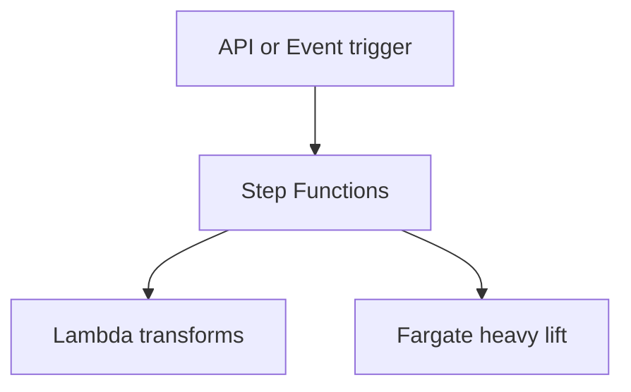
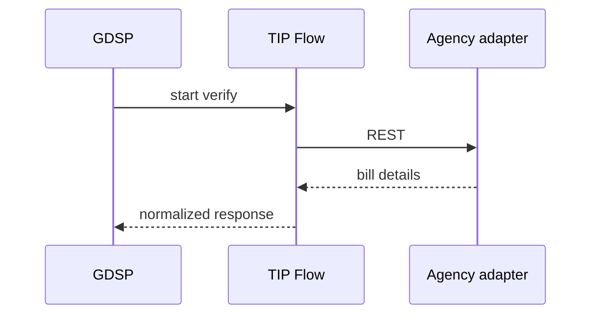

# 07 — Integration Flows

---

## Executive summary

**Integration flows** orchestrated with **Step Functions** + **Lambda** + **ECS Fargate** workers: multi-step partner journeys, compensations, file-based batches, protocol hops.

---

## Business purpose

Replace ad-hoc scripts with governed, observable flows.

---

## Architecture overview

---

## Flow types

Sync API orchestration · Event-driven pipelines · Scheduled reconciliation file pull · Human approval task (callback to GDSP) · Saga with compensating TNPI refund *(invoke TNPI API only)*.

---

## Data mapping

JSONata / mapping templates in flow definitions; version controlled in Git.

---

## Sequence: GEPG bill verify flow

---

## Monitoring

Per-flow success rate, duration — CloudWatch + X-Ray.

---

## Implementation strategy

TIP-F1 flow runtime + 3 reference flows.

---

## Cross-references

[08_ESB_ADAPTER_LAYER.md](08_ESB_ADAPTER_LAYER.md)
