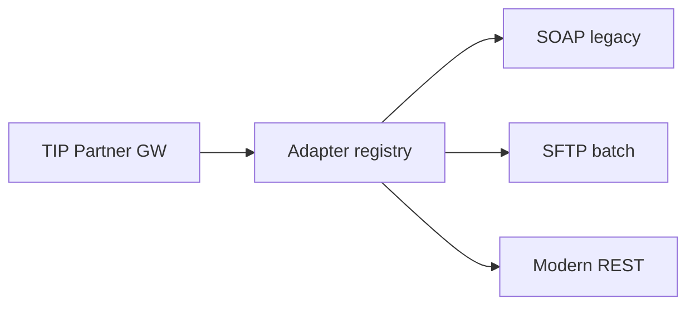

# 08 — ESB Adapter Layer

---

## Executive summary

**ESB-style adapter layer** for legacy and partner systems: REST/SOAP, SFTP file drop, CSV/XML, protocol translation, data mapping—Fargate workers + Step Functions.

---

## Business purpose

Connect banks, MDAs, and enterprises without forcing immediate API modernization.

---

## Architecture overview

---

## Adapter catalog (indicative)

| Partner type | Adapter |
| --- | --- |
| Bank | ISO20022 / proprietary REST |
| MNO | Mobile money API normalize |
| GEPG / gov billing | Control number |
| Hospital HMIS | HL7 FHIR bridge *(future)* |
| University SIS | CSV enrollment fees |

---

## Transformation

Canonical **Taifa Integration Model (TIM)** JSON schemas per domain; adapters map in/out.

---

## Security

mTLS, PGP for files, virus scan on ingress S3.

---

## Implementation strategy

Certified adapter SDK; partner implements to TIM contract.

---

## Cross-references

[government/17_GOVERNMENT_INTEGRATION_GUIDE.md](../government/17_GOVERNMENT_INTEGRATION_GUIDE.md)
