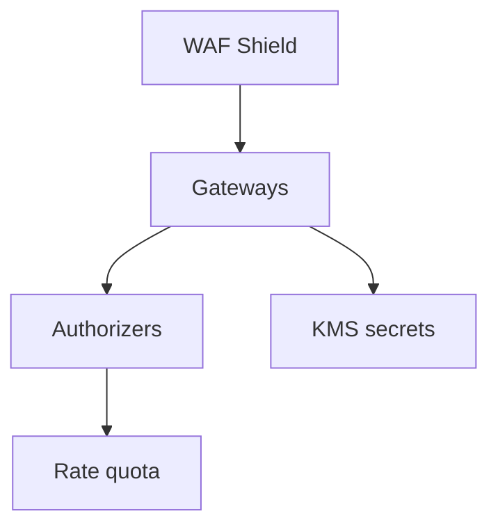

# 09 — API Security

---

## Executive summary

TIP security: **OAuth2**, **OIDC** (Taifa Identity), **API keys**, **mTLS**, request signing, rate limiting, throttling, IP allowlists, WAF, Shield, KMS, Secrets Manager, certificate lifecycle.

---

## Business purpose

National integration is the primary attack surface—defense in depth here.

---

## Architecture overview

---

## Auth matrix

| Consumer | Mechanism |
| --- | --- |
| Citizen app | OIDC JWT |
| Partner bank | mTLS + OAuth client credentials |
| Internal service | IAM SigV4 / mesh identity |
| Webhook receiver | HMAC signature |
| Legacy agency | mTLS + API key rotation |

---

## Rate limiting & throttling

API Gateway usage plans; burst vs steady; 429 with `Retry-After`; per-product overrides.

---

## Audit

All key issuance, cert rotation, policy change → Core Audit platform.

---

## Implementation strategy

TIP-S0 security baseline.

---

## Cross-references

[18_SECURITY_MODEL.md](18_SECURITY_MODEL.md)
