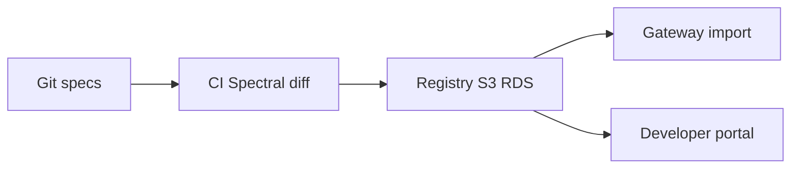

# 10 — OpenAPI Management

---

## Executive summary

**OpenAPI 3.1** registry: lint (Spectral), versioning, deprecation, aggregation for portals, Postman/ SDK generation CI, breaking-change detection.

---

## Business purpose

Contract-first integration at national scale.

---

## Architecture overview

---

## Versioning policy

URL `/v{n}` primary; `Sunset` header; minimum 12-month deprecation for partner APIs.

---

## API transformation

Request/response mapping at gateway from canonical OpenAPI models to legacy shapes (partner gateway only).

---

## Implementation strategy

Monorepo `openapi/taifa/` with domain folders.

---

## Cross-references

[payments/developer-platform/03_API_PLATFORM.md](../payments/developer-platform/03_API_PLATFORM.md)
