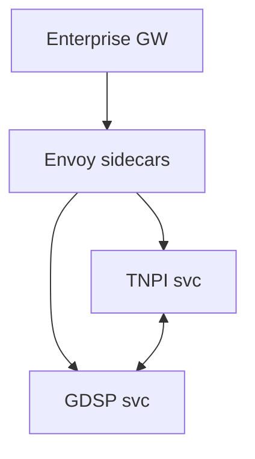

# 11 — Service Mesh

---

## Executive summary

**Service mesh** (AWS App Mesh or equivalent on ECS): east-west mTLS, traffic policy, retries, circuit breaking between Taifa microservices behind the enterprise gateway.

---

## Business purpose

Zero-trust inside the VPC; consistent observability between domains.

---

## Architecture overview

---

## Policies

Retry budget · timeout · outlier detection · allow-list which services may call TNPI orchestration directly (deny others).

---

## gRPC

Internal high-performance calls (e.g. risk assess hook) over mesh HTTP/2.

---

## Implementation strategy

Phase after gateway MVP; start with critical payment path.

---

## Cross-references

[19_AWS_ARCHITECTURE.md](19_AWS_ARCHITECTURE.md)
