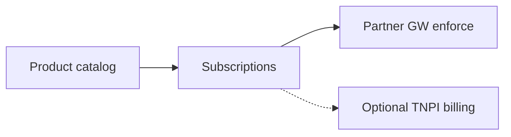

# 12 — API Marketplace

---

## Executive summary

**API marketplace**: discover, subscribe, and manage API products—partner-facing via Developer Portal; internal products for Taifa squads.

---

## Business purpose

Accelerate ecosystem growth with governed self-service.

---

## Architecture overview

---

## Product examples

`Payments Core` · `Government Bill Pay` · `Mobility Fares` · `Identity Verify` · `Webhook Delivery`

---

## Developer portal integration

Marketplace UI in Developer Platform; **TIP control plane** is SoR for subscriptions.

---

## Implementation strategy

TIP-M1 after partner GW.

---

## Cross-references

[13_SANDBOX_TESTING.md](13_SANDBOX_TESTING.md)
