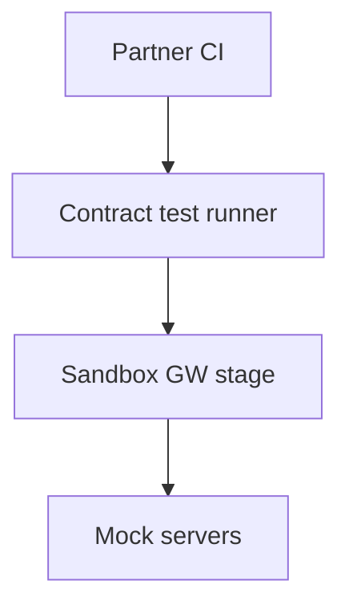

# 13 — Sandbox & Testing Platform

---

## Executive summary

**Integration sandbox**: virtual partners, mock adapters, contract testing, load test tiers, error injection—parity with production gateway policies.

---

## Business purpose

Certify partners before production keys/certs.

---

## Architecture overview

---

## Testing platform features

Postman/Newman CI · Pact contract tests · k6 load profiles · chaos (latency injection) · webhook simulator.

---

## Certification gate

Tests must pass for marketplace production subscription.

---

## Implementation strategy

Align with [payments/developer-platform/05_SANDBOX.md](../payments/developer-platform/05_SANDBOX.md).

---

## Cross-references

[23_ACCEPTANCE_CRITERIA.md](23_ACCEPTANCE_CRITERIA.md)
