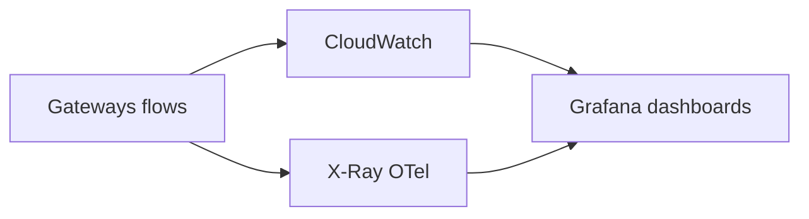

# 14 — Observability

---

## Executive summary

**Integration monitoring**: API analytics, error rates, latency SLOs, event lag, webhook success, **distributed tracing** (X-Ray/OpenTelemetry), dashboards, alerts.

---

## Business purpose

Operate national integration with SRE visibility.

---

## Architecture overview

---

## Key metrics

| Metric | Description |
| --- | --- |
| `tip.gateway.4xx/5xx` | By product route |
| `tip.gateway.latency.p99` | Partner vs internal |
| `tip.event.lag` | Consumer backlog |
| `tip.webhook.delivery_rate` | Success % |
| `tip.flow.failed` | Step Functions failures |
| `tip.adapter.errors` | ESB by partner |

---

## Distributed tracing

Propagate `traceparent` from edge through mesh to domain services.

---

## Audit platform integration

Security events correlated with trace IDs.

---

## Implementation strategy

TIP-O1 observability baseline day 1.

---

## Cross-references

[platform observability docs](../platform/00_PLATFORM_OVERVIEW.md)
