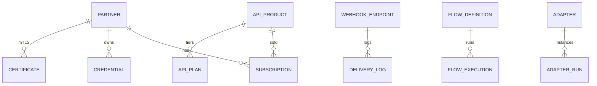

# 17 — Database Model

**Schema:** `integration_platform`

---

## Executive summary

SoR for partners, products, subscriptions, routes metadata, webhook configs, flow definitions—not domain business data.

---

## ER diagram

---

## Cross-references

[15_API_SPECIFICATION.md](15_API_SPECIFICATION.md)
