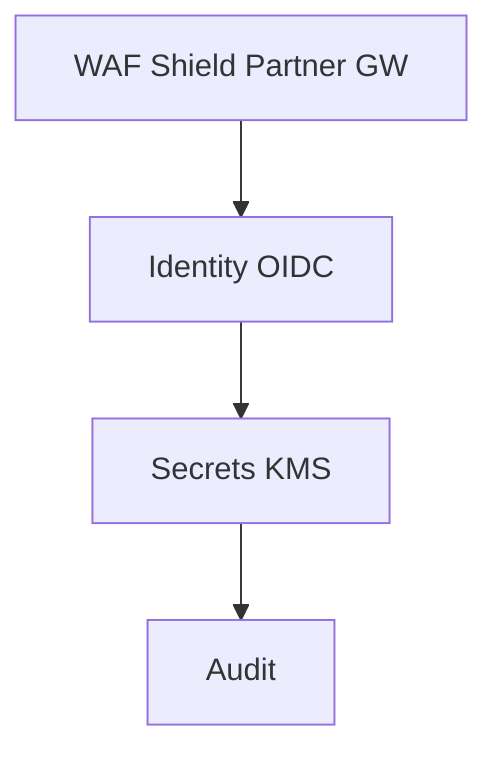

# 18 — Security Model

---

## Executive summary

Zero-trust integration security: segmentation, least privilege IAM, encryption, cert lifecycle, WAF/Shield, GuardDuty, Security Hub, integration audit.

---

## Security architecture

---

## Certificate management

ACM / Private CA; partner cert expiry alerts 30d; auto-renew internal certs.

---

## Secrets management

Secrets Manager rotation; no secrets in OpenAPI or logs.

---

## ADR

**ADR-TIP-001** — No domain business logic in TIP; integration only  
**ADR-TIP-002** — All external partner traffic via Partner Gateway  
**ADR-TIP-003** — All Taifa public APIs published through TIP enterprise gateway

---

## Cross-references

[09_API_SECURITY.md](09_API_SECURITY.md)
