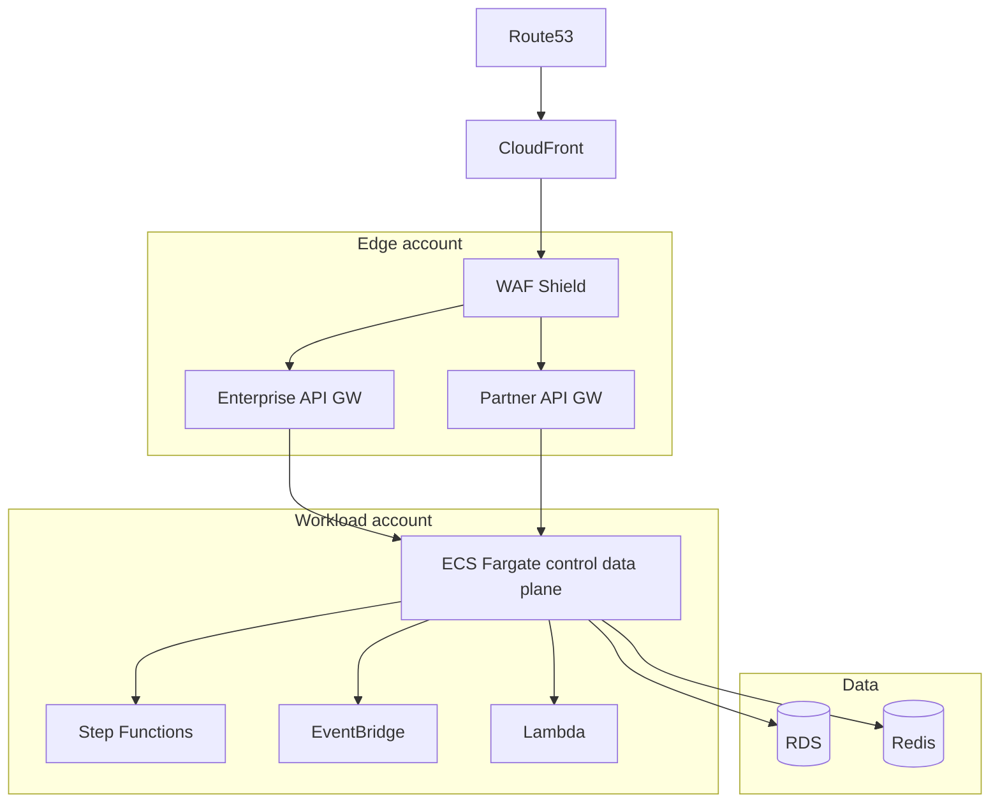

# 19 — AWS Architecture

---

## Executive summary

Production TIP on AWS: multi-account, **CloudFront**, **Route53**, **WAF**, **Shield**, dual **API Gateway** (enterprise + partner), **ECS Fargate**, **Lambda**, **Step Functions**, **EventBridge**, **SNS**, **SQS**, **RDS**, **Redis**, **CloudWatch**, **CloudTrail**, **KMS**, **Secrets Manager**, **Backup**.

---

## Architecture overview

---

## Multi-account

| Account | Purpose |
| --- | --- |
| Network | TGW, firewall |
| Integration prod | TIP runtime |
| Integration nonprod | Sandbox |
| Security | Logs, GuardDuty agg |

---

## DR

Multi-AZ; cross-region EventBridge archive; RTO 4h national target.

---

## Cross-references

[11_SERVICE_MESH.md](11_SERVICE_MESH.md) · [20_IMPLEMENTATION_GUIDE.md](20_IMPLEMENTATION_GUIDE.md)
