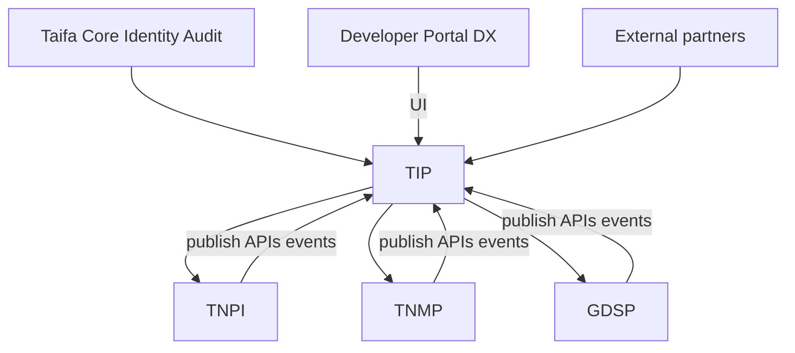

# 20 — Implementation Guide

---

## Executive summary

Phased TIP delivery: **foundation gateway + bus** → **partner edge + webhooks** → **flows + ESB** → **mesh + marketplace**—migrate existing Core gateway and Developer Platform runtime incrementally.

---

## Dependency graph

---

## Migration strategy

| From | To TIP |
| --- | --- |
| Core API Gateway config | Enterprise GW import |
| DevPlatform webhook workers | TIP webhook service |
| Per-domain API keys | TIP credential service |
| Ad-hoc agency VPN | Partner GW mTLS |

---

## Team model

Platform integration squad owns TIP; domains publish OpenAPI only.

---

## Implementation strategy

[21_ROADMAP.md](21_ROADMAP.md) · [22_BACKLOG.md](22_BACKLOG.md) · [TIP_GATE_PACKAGE.md](TIP_GATE_PACKAGE.md).

---

## Cross-references

[23_ACCEPTANCE_CRITERIA.md](23_ACCEPTANCE_CRITERIA.md)
