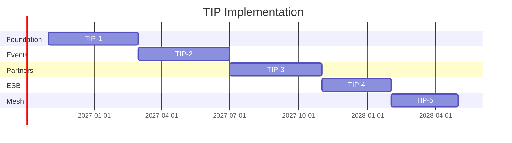

# 21 — Roadmap

---

## Executive summary

**18-month** implementation roadmap: foundation → partner scale → ESB & flows → mesh & marketplace maturity.

---

## Phases

| Phase | Months | Outcome |
| --- | --- | --- |
| **TIP-1** | 1–4 | Enterprise GW, OpenAPI CI, observability |
| **TIP-2** | 5–8 | Event bus registry, webhooks, TNPI route migration |
| **TIP-3** | 9–12 | Partner GW, mTLS, sandbox, marketplace v1 |
| **TIP-4** | 13–15 | Flows + 5 ESB adapters (bank, MNO, GEPG) |
| **TIP-5** | 16–18 | Service mesh payment path, Kafka analytics tap |

---

## National rollout

All Taifa domains cut over to TIP gateway by end TIP-2; partners onboard TIP-3+.

---

## Cross-references

[TIP_GATE_PACKAGE.md](TIP_GATE_PACKAGE.md)
