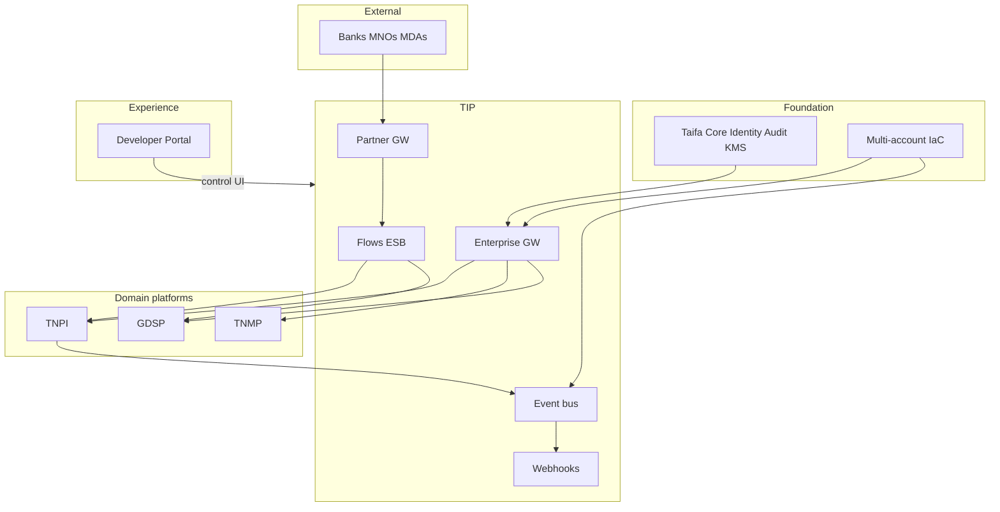

# TIP — Gate Package

**Product:** Taifa Integration Platform (TIP)  
**Status:** Architecture planning complete  
**Date:** 2026-08-06

---

## 1. Product Readiness Report

### Executive summary

**TIP** (`docs/integration/00–25`) is Tanzania’s **national digital integration backbone**: enterprise & partner API gateways, API management, event bus, messaging, webhooks, flows, ESB adapters, OpenAPI, marketplace, sandbox, observability—**no business application logic**.

### Readiness matrix

| Dimension | Status |
| --- | --- |
| Business architecture, capability map, context | ✅ |
| Gateway, bus, webhooks, flows, ESB, security | ✅ |
| AWS, control APIs, event master index, ER | ✅ |
| Roadmap, backlog, acceptance, risks | ✅ |
| **Implementation** | ⬜ |
| **Core gateway migration** | ⬜ |
| **Taifa Core Identity/Audit** | ✅ assumed |

### Verdict

| Question | Answer |
| --- | --- |
| Start TIP implementation? | **Yes** (architecture) |
| National production backbone? | After §5 production readiness |
| Domains may expose public APIs without TIP? | **No** (ADR-TIP-003 target state) |

---

## 2. Architecture Review Report

### Scope

TIP vs Core gateway evolution; vs Developer Platform; domain boundaries; partner security; event governance.

### Findings

| ID | Finding | Severity | Action |
| --- | --- | --- | --- |
| AR-T-01 | TIP must not host payment/gov/mobility rules | Critical | ADR-TIP-001 |
| AR-T-02 | Partner traffic isolation | Critical | Partner GW AR-TIP-002 |
| AR-T-03 | Single OpenAPI source of truth | High | TIB-003 |
| AR-T-04 | Webhook consolidation | High | TIB-008 migrate |
| AR-T-05 | Event schema sprawl | Med | TIB-007 master catalog |
| AR-T-06 | Mesh premature | Med | Defer TIP-5 |
| AR-T-07 | Kafka scope creep | Med | Analytics tap only |

### Verdict

**Approved to implement TIP-1** when multi-account IaC and Identity authorizer contract are ready.

---

## 3. Sprint Breakdown

| Sprint | Weeks | Focus | Backlog |
| --- | --- | --- | --- |
| **TIP-S1** | 3 | IaC, enterprise GW, WAF | TIB-001–002 |
| **TIP-S2** | 3 | OpenAPI registry, RDS control plane | TIB-003, 005 |
| **TIP-S3** | 3 | Observability, trace, dashboards | TIB-004, 022 |
| **TIP-S4** | 4 | Event bus, archive, catalog | TIB-006–007 |
| **TIP-S5** | 4 | Webhooks + TNPI route migration | TIB-008–009 |
| **TIP-S6** | 4 | Partner GW, mTLS, onboarding | TIB-010–011 |
| **TIP-S7** | 3 | Sandbox, contract tests | TIB-012 |
| **TIP-S8** | 3 | Marketplace + dev portal wire | TIB-013–014 |
| **TIP-S9** | 4 | Flows + bank/MNO/GEPG adapters | TIB-015–018 |
| **TIP-S10** | 3 | Mesh pilot, DR drill, gate | TIB-020, 023–024 |

**Total:** ~34 weeks to production-ready partner scale.

---

## 4. Dependency Graph

---

## 5. Production Readiness Assessment

| Area | Staging target | Production target |
| --- | --- | --- |
| Enterprise GW availability | 99.5% | 99.9% |
| Partner GW availability | 99.5% | 99.95% (SLA tier) |
| Webhook success | ≥98% | ≥99% |
| P99 internal API overhead | &lt;50ms | &lt;30ms |
| WAF + Shield | Enabled | Advanced Shield on partner |
| DR drill | Optional | Required TIP-S10 |
| Pen test | Internal | External before partner prod |
| Domain logic in TIP | 0 | 0 (CI scan) |
| OpenAPI coverage | 80% routes | 100% public routes |

**Verdict:** Architecture **ready**; **production national backbone** after **TIP-S5** (events + webhooks + TNPI on TIP) + **TIP-S6–S8** (partner pilot) sign-off.

---

## 6. Implementation Roadmap (summary)

See [21_ROADMAP.md](21_ROADMAP.md): **TIP-1** foundation → **TIP-2** events/webhooks → **TIP-3** partners/marketplace → **TIP-4** ESB → **TIP-5** mesh/Kafka analytics.

**MVP (TIP-1 + TIP-2 partial):** All staging Taifa APIs on enterprise gateway; event bus live; TNPI payment events subscribed by GDSP/TNMP workers.

**National:** Partner GW + 3 certified adapters (bank, MNO, GEPG) by TIP-4.

---

## Cross-references

[00_PLATFORM_OVERVIEW.md](00_PLATFORM_OVERVIEW.md) · [platform/02_API_GATEWAY_PLATFORM.md](../platform/02_API_GATEWAY_PLATFORM.md)
