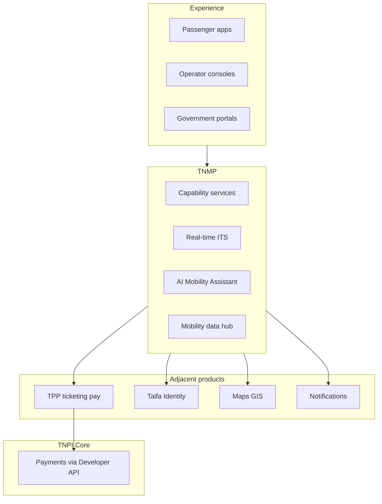
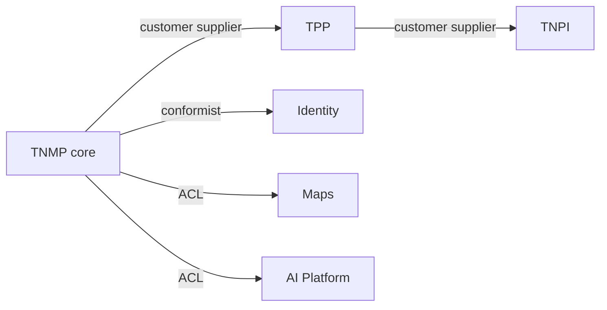

# Taifa National Mobility Platform (TNMP) — Overview

**Product:** National Mobility Platform (TNMP)  
**Program:** Taifa Mobility (20-year horizon)  
**Bounded context:** `mobility.core` (+ federated `mobility.*` domains)  
**Status:** Architecture & implementation planning — **no production code**

---

## Mission

Tanzania’s **unified mobility operating system**: connecting passengers, operators, infrastructure, government, and **payment services (TNPI via TPP)**—not a ticketing-only or payment-only product, but the national digital layer for how people and goods move.

```
Passengers · Operators · Govt · Infrastructure → TNMP (ops, ITS, AI, analytics) → TPP → TNPI
```

---

## Relationship to TPP and TNPI

| Layer | Role | Payments |
| --- | --- | --- |
| **TNMP** | Mobility OS: fleet, tracking, schedules, incidents, gov analytics, AI assistant | **None** — delegates to TPP |
| [TPP (Transport Payments)](../transport/00_PLATFORM_OVERVIEW.md) | Tickets, fares, passes, validation, TNPI metadata | **Consumes TNPI only** |
| **TNPI Core** | National payment infrastructure | SoR for money |

**Rule:** No payment orchestration, settlement, reconciliation, fraud, or merchant logic in TNMP.

---

## Business architecture



---

## Capability model (L0)

| L0 | Capabilities |
| --- | --- |
| **Travel** | Trip/journey planning, AI assistant, accessibility |
| **Operations** | Fleet, driver, vehicle, schedule, real-time tracking |
| **Network** | Routes, stops, stations, capacity |
| **Commerce** | Ticketing & passes *(via TPP)*, subscriptions, corporate billing *(TNPI)* |
| **Governance** | Govt dashboards, inspection, compliance, subsidies policy hooks |
| **Resilience** | Incidents, emergency, lost & found, support |
| **Intelligence** | Analytics, heat maps, predictive capacity, carbon metrics |

---

## Domain model (summary)

| Aggregate | Owner | Notes |
| --- | --- | --- |
| `Passenger` | TNMP | Linked to Identity |
| `Operator` | TNMP | Links TPP `merchant_id` |
| `Fleet` / `Vehicle` / `Driver` | TNMP | Telematics refs |
| `Route` / `Stop` / `Station` | TNMP | Canonical network (TPP may mirror fare view) |
| `Trip` / `Journey` | TNMP | Operational trip |
| `Ticket` / `Pass` | TPP | TNMP references `ticket_id` |
| `Payment` | TNPI | TNMP stores `payment_id` refs only via TPP events |
| `Incident` | TNMP | Ops/gov |

---

## Context map



---

## Supported transport (20-year catalog)

Public: dala dala, BRT, TRC, SGR, ferries, bus companies, school/corporate shuttles  
Private: taxi, ride-hail, bajaji, bodaboda, car rental, tour operators  
Infrastructure: parking, future tolls, EV charging, logistics, autonomous/drone *(future)*

---

## Document map

| # | Document |
| --- | --- |
| Gate | [TNMP_GATE_PACKAGE.md](TNMP_GATE_PACKAGE.md) |
| 01–18 | See below |

| # | File |
| --- | --- |
| 01 | [01_PRODUCT_VISION.md](01_PRODUCT_VISION.md) |
| 02 | [02_PASSENGER_PLATFORM.md](02_PASSENGER_PLATFORM.md) |
| 03 | [03_OPERATOR_PLATFORM.md](03_OPERATOR_PLATFORM.md) |
| 04 | [04_FLEET_PLATFORM.md](04_FLEET_PLATFORM.md) |
| 05 | [05_AI_MOBILITY.md](05_AI_MOBILITY.md) |
| 06 | [06_ROUTE_MANAGEMENT.md](06_ROUTE_MANAGEMENT.md) |
| 07 | [07_TICKETING.md](07_TICKETING.md) |
| 08 | [08_API_SPECIFICATION.md](08_API_SPECIFICATION.md) |
| 09 | [09_EVENT_CATALOG.md](09_EVENT_CATALOG.md) |
| 10 | [10_DATABASE_MODEL.md](10_DATABASE_MODEL.md) |
| 11 | [11_SECURITY_MODEL.md](11_SECURITY_MODEL.md) |
| 12 | [12_AWS_ARCHITECTURE.md](12_AWS_ARCHITECTURE.md) |
| 13 | [13_IMPLEMENTATION_GUIDE.md](13_IMPLEMENTATION_GUIDE.md) |
| 14 | [14_ROADMAP.md](14_ROADMAP.md) |
| 15 | [15_BACKLOG.md](15_BACKLOG.md) |
| 16 | [16_ACCEPTANCE_CRITERIA.md](16_ACCEPTANCE_CRITERIA.md) |
| 17 | [17_DEFINITION_OF_DONE.md](17_DEFINITION_OF_DONE.md) |
| 18 | [18_RISK_REGISTER.md](18_RISK_REGISTER.md) |

---

## Cross-references

[Architecture Constitution](../architecture/00_ARCHITECTURE_CONSTITUTION.md) · [Taifa Core](../platform/00_PLATFORM_OVERVIEW.md) · [TNPI](../payments/00_PAYMENT_PROGRAM.md)
