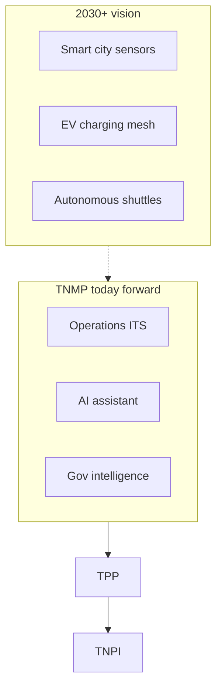
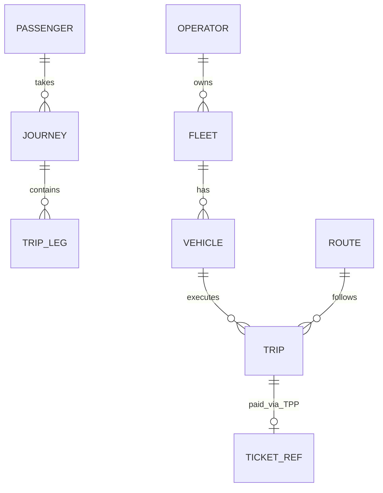
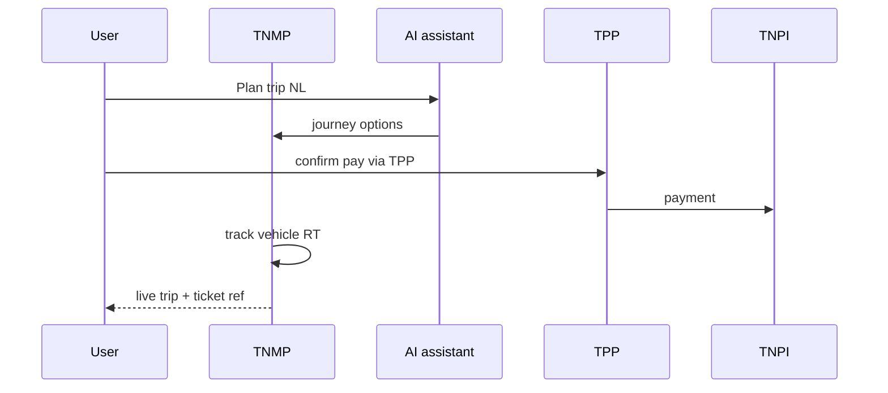

# 01 — Product Vision

---

## Executive summary

**TNMP** is Tanzania’s **20-year national mobility platform**: one digital nervous system for public and private transport, tourism, government fleets, emergencies, and future autonomous/EV/smart-city infrastructure—**payments exclusively through [TPP](../transport/00_PLATFORM_OVERVIEW.md) → TNPI**.

---

## Business purpose

Unify mobility data and operations nationwide; enable cashless adoption, safety, planning, and regional integration without fragmenting payment infrastructure.

---

## Architecture overview

---

## Vision statement

**One platform for every journey—planned, paid, operated, and governed with trust.**

---

## Strategic pillars

| Pillar | Outcome |
| --- | --- |
| **Connected** | Real-time fleet & passenger awareness |
| **Inclusive** | Accessibility-first planning |
| **Cashless** | TNPI-mediated fares (TPP) |
| **Transparent** | Govt analytics & LATRA oversight |
| **Intelligent** | AI planning & predictive ops |
| **Regional** | East Africa interoperability (future) |

---

## Capability model (detailed)

Passenger · Operator · Fleet · Driver · Vehicle · Route/Stop/Station · Trip/Journey · AI planner · RT tracking · Schedules · Ticketing *(TPP)* · Subscriptions *(TPP/TNPI)* · Analytics · Govt dashboards · Incidents · Emergency · Accessibility · Inspection · Lost & found · Support.

---

## Domain model

---

## Payments (delegation)

| Need | Call |
| --- | --- |
| Buy ticket / pass | TPP APIs → TNPI |
| Corporate / govt subsidy | TNPI metadata + TPP products |
| Revenue dashboard | TNPI settlement read via TPP/portal |

---

## Sequence: passenger day

---

## Security considerations

National-scale PII; role separation — [11_SECURITY_MODEL.md](11_SECURITY_MODEL.md).

---

## AWS

Multi-region ready architecture — [12_AWS_ARCHITECTURE.md](12_AWS_ARCHITECTURE.md).

---

## Implementation strategy

MVP → national → smart city — [14_ROADMAP.md](14_ROADMAP.md).

---

## Future expansion

Drone corridors · V2X · cross-border East Africa pass.

---

## Cross-references

[TNMP_GATE_PACKAGE.md](TNMP_GATE_PACKAGE.md)
