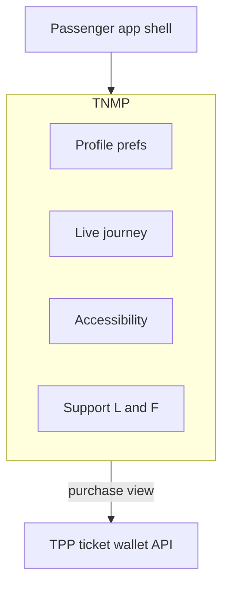
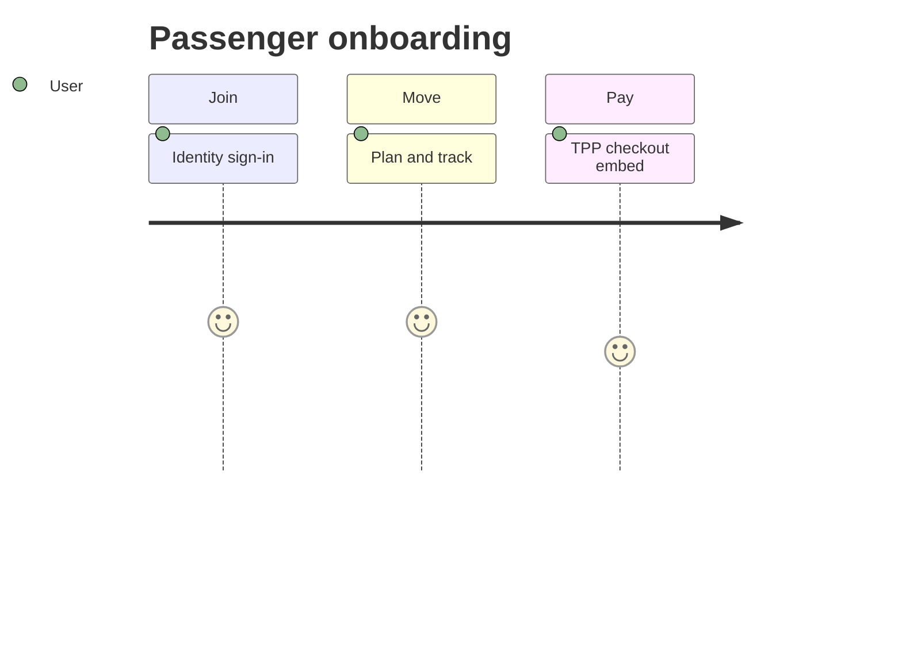

# 02 — Passenger Platform

---

## Executive summary

National **passenger experience**: profile (Identity), multimodal discovery, live trips, tickets *(TPP wallet embed)*, accessibility, support, lost & found, emergency—TNMP orchestrates UX; **never charges cards/wallets directly**.

---

## Business purpose

Single citizen-facing mobility layer across Taifa apps and partner white-labels.

---

## Architecture overview

---

## Capabilities

Trip/journey UI · AI chat entry · RT vehicle map · Notifications · Accessibility profiles (wheelchair, vision) · Incident report · Emergency share location · Customer support tickets · Lost & found registry.

---

## Developer journey

---

## Integration

| Service | Use |
| --- | --- |
| Identity | SSO, eligibility |
| Maps | Map tiles, ETA |
| TPP | Tickets, passes, fares |
| Notifications | Trip updates |
| AI | [05_AI_MOBILITY.md](05_AI_MOBILITY.md) |

---

## API

`/v1/mobility/passengers/*` — [08_API_SPECIFICATION.md](08_API_SPECIFICATION.md).

---

## Security

Location sharing opt-in; minor guardian mode (future).

---

## Operational considerations

Offline map cache; low-bandwidth mode.

---

## Implementation strategy

NM-2 passenger BFF after Identity integration.

---

## Future expansion

WhatsApp journey bot; USSD status (*no payment on USSD without TNPI*).

---

## Cross-references

[07_TICKETING.md](07_TICKETING.md)
