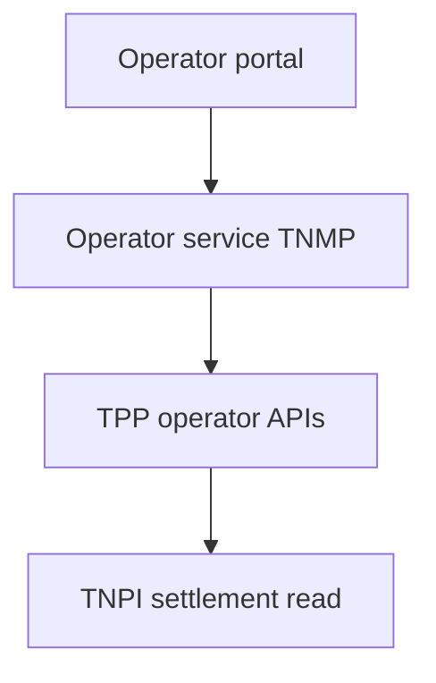
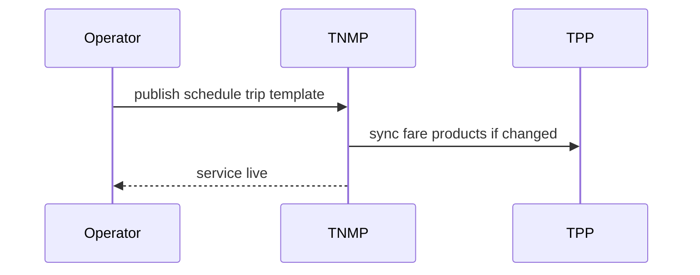

# 03 — Operator Platform

---

## Executive summary

**Operator console** for transport companies, BRT/TRC/ferry/airlines, tour operators, school/corporate transport, government agencies—schedules, rostering, compliance, revenue views *(TNPI via TPP)*, inspection coordination.

---

## Business purpose

Digitize operator back-office without each operator building ITS/payments stacks.

---

## Architecture overview

---

## Personas

Fleet owners · BRT/TRC/ferry/airline admins · LATRA registrants · Municipal transport · Tour/school/corporate fleet managers · Conductors/drivers *(limited apps)* · Inspectors.

---

## Capabilities

Org hierarchy · Service contracts · Schedule publishing · Driver roster · Fare policy *(TPP)* · Revenue & ridership dashboards · Document vault (licenses) · Inspection results · Incident escalation.

---

## Sequence: publish service

---

## Government read-through

Municipal users see aggregated operator performance; no raw PII export without policy.

---

## Security

Operator RBAC; multi-tenant isolation.

---

## AWS

Fargate operator BFF; Cognito via Identity.

---

## Implementation strategy

NM-3 after fleet registry MVP.

---

## Future expansion

Franchise billing rules still via TNPI/TPP only.

---

## Cross-references

[04_FLEET_PLATFORM.md](04_FLEET_PLATFORM.md) · [transport/03_OPERATOR_PLATFORM.md](../transport/03_OPERATOR_PLATFORM.md)
