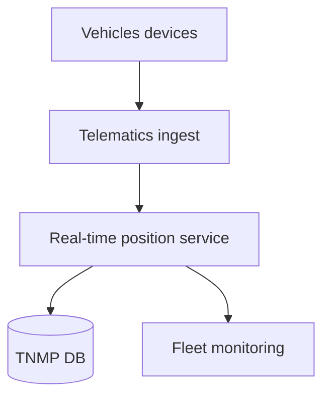
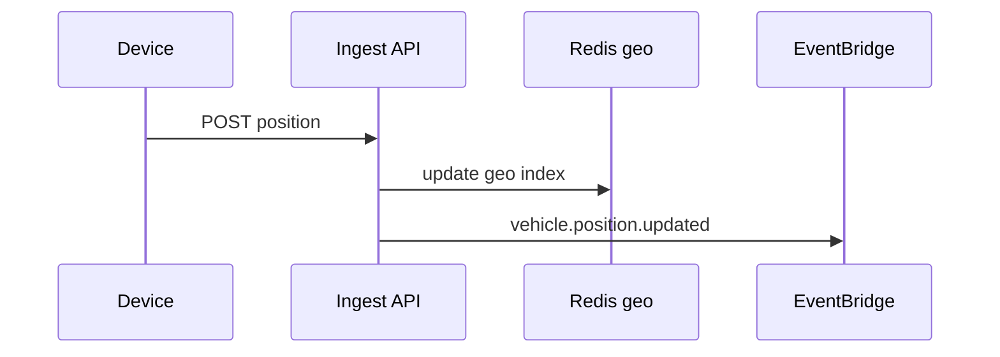

# 04 — Fleet Platform

---

## Executive summary

**Fleet, vehicle, driver** lifecycle: registration, assignment, telematics ingestion, real-time tracking, monitoring, utilization analytics—core ITS data plane for TNMP.

---

## Business purpose

National visibility of moving assets for operators and government (LATRA, traffic authorities).

---

## Architecture overview

---

## Capabilities

Fleet registry · Vehicle identity (plate, VIN, mode) · Driver/conductor credentials · Assignment shifts · GPS/AVL ingest · Geofence depots · Maintenance flags · Utilization KPIs · Capacity occupancy *(where sensors exist)*.

---

## Events

`fleet.updated`, `vehicle.departed`, `vehicle.arrived`, `driver.assigned` — [09_EVENT_CATALOG.md](09_EVENT_CATALOG.md).

---

## Sequence: real-time position

---

## Integration

LATRA compliance fields; optional third-party telematics ACL.

---

## Security

Device certificates; spoofing detection heuristics.

---

## AWS

Location Services + Redis geo; Kinesis optional for high volume.

---

## Implementation strategy

NM-4 fleet MVP with manual GPS app before hardware AVL.

---

## Future expansion

V2X feeds; autonomous vehicle mission control API.

---

## Cross-references

[06_ROUTE_MANAGEMENT.md](06_ROUTE_MANAGEMENT.md) · [12_AWS_ARCHITECTURE.md](12_AWS_ARCHITECTURE.md)
