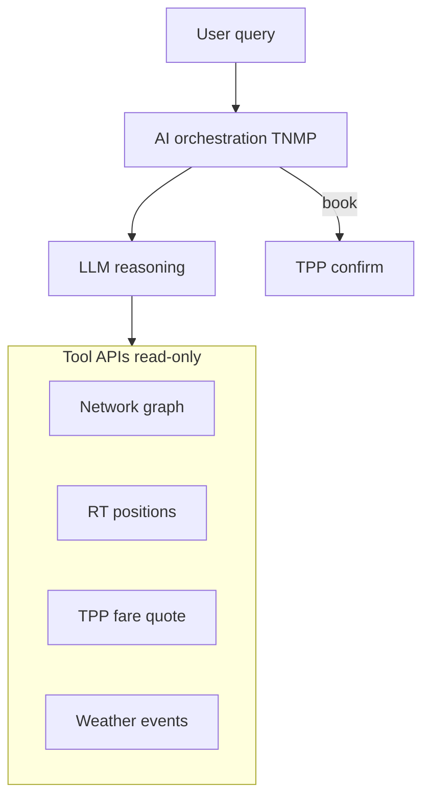
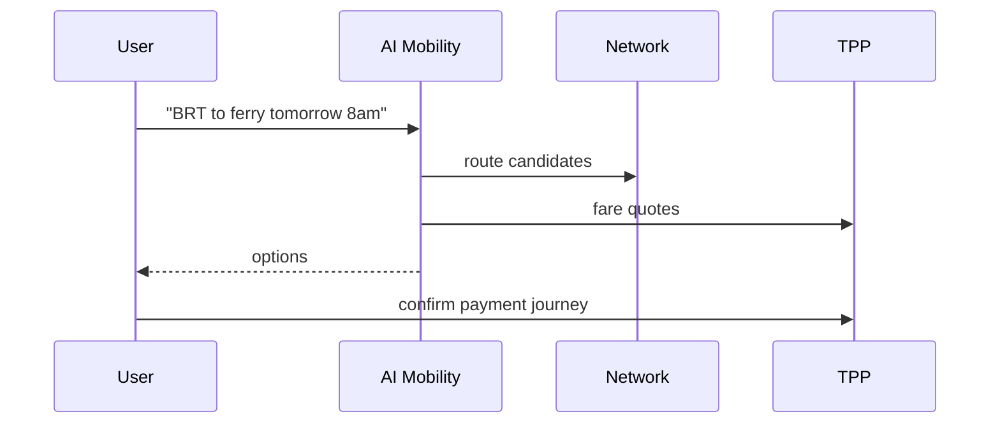

# 05 — AI Mobility

---

## Executive summary

**Enterprise AI Mobility Assistant**: NL planning, multimodal optimization, fare/time prediction, delays, tourist & accessibility routing, emergency reroute, predictive capacity—**fare execution via TPP/TNPI**, not AI.

---

## Business purpose

Differentiated national UX comparable to Citymapper + conversational layer; 20-year extensibility to traffic optimization.

---

## Architecture overview

---

## Capabilities

| Capability | Description |
| --- | --- |
| NL planning | Swahili/English |
| Journey optimization | Time/cost/accessibility weights |
| Fare optimization | Suggests passes vs singles via TPP quotes |
| ETA / delay prediction | ML on historical + RT |
| Tourist mode | POI-aware (Maps) |
| Accessibility | Step-free paths, audio guidance hooks |
| Emergency reroute | Incident graph avoidance |
| Predictive capacity | Operator dashboard feed |
| Future traffic opt | City digital twin hook |

---

## Sequence: plan and book

---

## Guardrails

No autonomous payment without explicit user confirm; cite sources (route IDs); fallback rules if LLM down.

---

## Security

Prompt injection filters; no PAN/PII in model logs.

---

## AWS

Bedrock or Taifa AI platform; feature store for ML ETA models.

---

## Implementation strategy

Phase A rules → Phase B ML ETA → Phase C LLM assistant.

---

## Future expansion

Municipal traffic signal advisory (regulatory gated).

---

## Cross-references

[transport/06_AI_JOURNEY_PLANNER.md](../transport/06_AI_JOURNEY_PLANNER.md) · [14_ROADMAP.md](14_ROADMAP.md)
